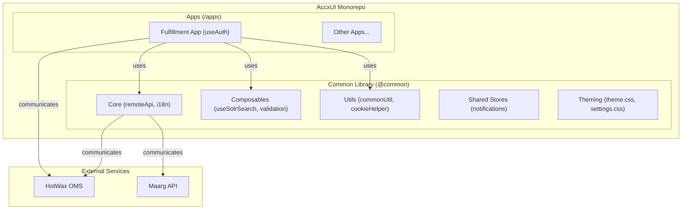
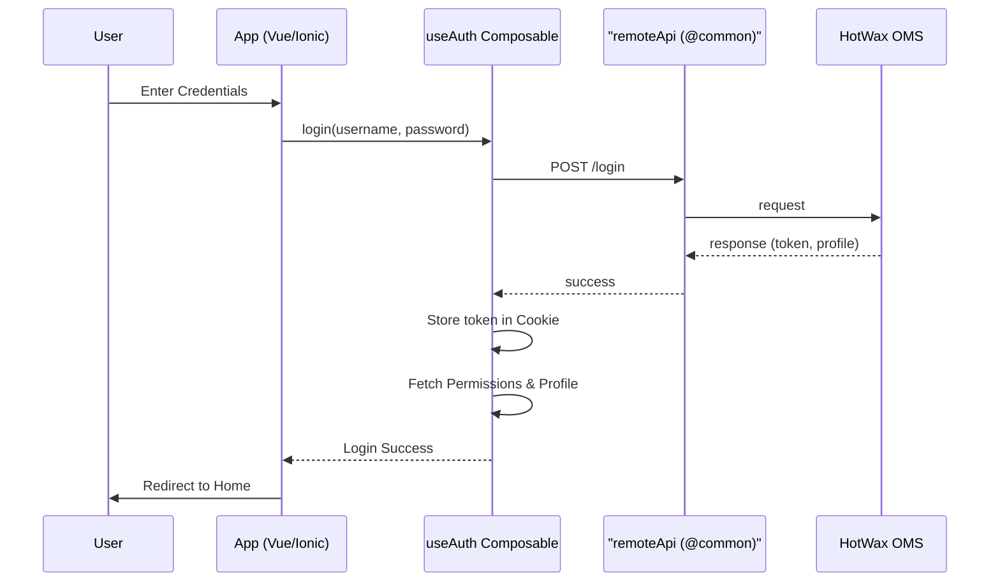
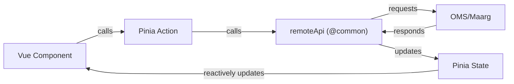

# AccxUI Architecture Document

## 1. Overview
### 1.1 Objective
Standardize and accelerate micro-frontend development within the AccxUI ecosystem by providing a shared core of reusable services, utilities, and components.

### 1.2 Problem Statement
Developing multiple micro-frontends independently lead to:
- High boilerplate code.
- Inconsistent implementations of authentication, API communication, and internationalization.
- Increased maintenance overhead.

### 1.3 Success Criteria
- Reduction in application-specific boilerplate.
- Consistent user experience across different apps.
- Centralized maintenance of core logic in the `@common` package.

## 2. Scope
### 2.1 In Scope
- Root `common/` directory containing shared assets, components, core logic, and utilities.
- `apps/` directory for micro-frontend applications (e.g., `fulfillment`).
- Shared build and linting configurations.
- Standardized patterns for Auth, API, and State Management.

### 2.2 Out of Scope
- Specific business logic for individual applications.
- External backend services (e.g., OMS, Maarg API) beyond integration patterns.

## 3. Background / Context
AccxUI is a monorepo for micro-frontends built using **Vue 3**, **Ionic Framework**, and **Vite**. It addresses the need for a scalable and maintainable front-end architecture for HotWax systems. The architecture leverages a shared `@common` alias to provide access to core functionalities from any application in the monorepo.

## 4. Proposed Solution (Current Architecture)

### 4.1 High-Level Design
AccxUI uses a monorepo structure managed by `pnpm`. The root `common/` directory is linked into each application via a Vite alias (`@common`), allowing apps to consume shared modules without duplicated code.

**Key Architecture Components:**
- **Shared Core**: Centralized logic for API calls, Auth, I18n, and Logging.
- **Micro-frontends**: Apps located in `apps/*`, each focused on a specific domain (e.g., fulfillment).
- **Vite Build System**: Optimized for fast development and production builds.

### 4.2 Common Functionality Offered by AccxUI
The `@common` library provides several critical modules that all applications should use:

- **Remote API (`remoteApi.ts`)**:
  - A robust wrapper around Axios.
  - Automatically injects auth tokens into request headers.
  - Centralized error and unauthorized response handling.
  - Supports Maarg and OMS base URLs.

- **Internationalization (`i18n.ts`)**:
  - Multi-language support with `vue-i18n`.
  - Reusable `translate` function and locale switching helpers.
- **Composables**:
  - `useSolrSearch`: Pattern for efficient searching and filtering.
  - `useFormValidation`: Schema-based validation using `Yup` and `VeeValidate`.
- **Utilities & Helpers**:
  - `commonUtil`: Generic utilities for error analysis and showing toasts.
  - `cookieHelper`: Abstraction for cookie management.
  - `logger` & `emitter`: Standardized logging and global event bus.
- **Integrated Services**:
  - `ShopifyService`: Core logic for Shopify-integrated features.
  - `firebaseMessaging`: Support for push notifications.
- **Theming (`common/css`)**:
  - `theme.css`: Standardized CSS variables (spacers, colors) and utility classes (list-item, empty-state).
  - `settings.css`: Reusable styles for application settings and configuration views.

### 4.3 App Building Pattern (How to build using common functionality)
When building a new app in AccxUI, follow this pattern:

1.  **Vite Configuration**: Set up the `@common` alias to point to the root `common/` directory.
2.  **Authentication Integration**:
    - Implement a `useAuth` composable within the app's `composables` directory.
    - Leverage `client`, `cookieHelper`, and `emitter` from `@common` for identity and session management.
    - Implement a `Login.vue` that consumes `login` and `isAuthenticated` from `useAuth`.
3.  **Post-Login Initialization**:
    - Define a `userStore` (Pinia) to manage user session.
    - After login, fetch:
        - **Permissions**: Fetch from OMS to determine access.
        - **UserProfile**: Fetch user-specific details.
        - **Contextual State**: Facilities, product stores, and preferences.
4.  **Router Guards**:
    - Use router guards to protect routes by checking `isAuthenticated` and specific user permissions.
5.  **API Communication**:
    - Always use the `api` or `client` exports from `@common` for any network requests.
6.  **Theming**:
    - Import `@common/css/theme.css` and `@common/css/settings.css` in the app's main entry point (e.g., `index.ts`) to ensure a consistent visual identity.
    - Use local `variables.css` for app-specific overrides.

## 5. Data State & Storage Strategy

### 5.1 Pinia State Structure
- Applications use **Pinia** for local state management.
- State is persistent using `pinia-plugin-persistedstate`.
- Standard stores include `user`, `util`, `product`, and domain-specific stores.

### 5.2 Data Flow
1.  **API → Store**: Data is fetched from Maarg/OMS using the shared `api` method and populated into Pinia stores.
2.  **Store → UI**: Components reactively bind to store properties.

## 6. Security & Permissions
- Authentication status is verified via tokens stored in cookies.
- Authorization is managed by fetching permissions post-login and checking them before navigating to or rendering protected features using the `hasPermission` helper.

## 7. Verification Plan
- **Unit Testing**: Applications should include unit tests using `Vitest`.
- **Linting**: Ensure code quality via `Eslint` and `TypeScript` compilation checks.

## 8. References
- [Ionic Documentation](https://ionicframework.com/docs)
- [Vue 3 Documentation](https://vuejs.org/guide/introduction.html)
- [Maarg API Documentation](https://docs.hotwax.co/maarg-system-documentation/maarg-architecture)
