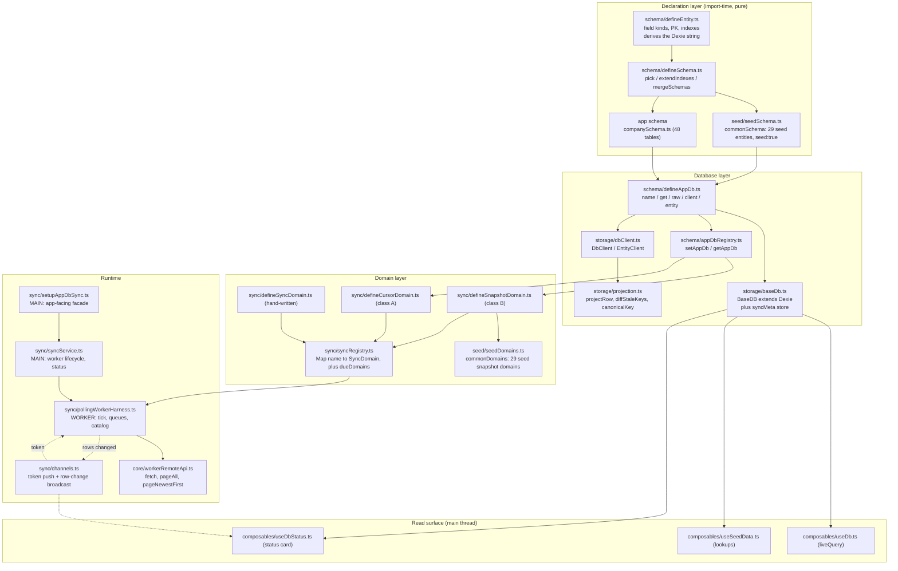
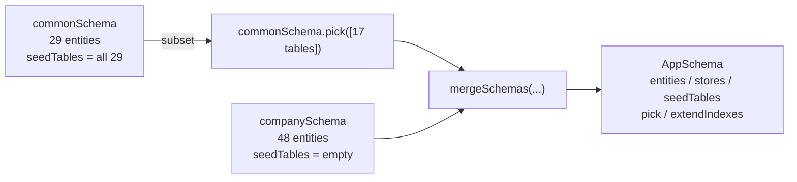
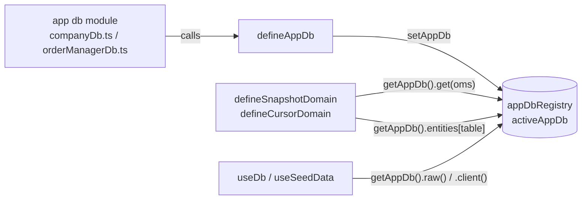
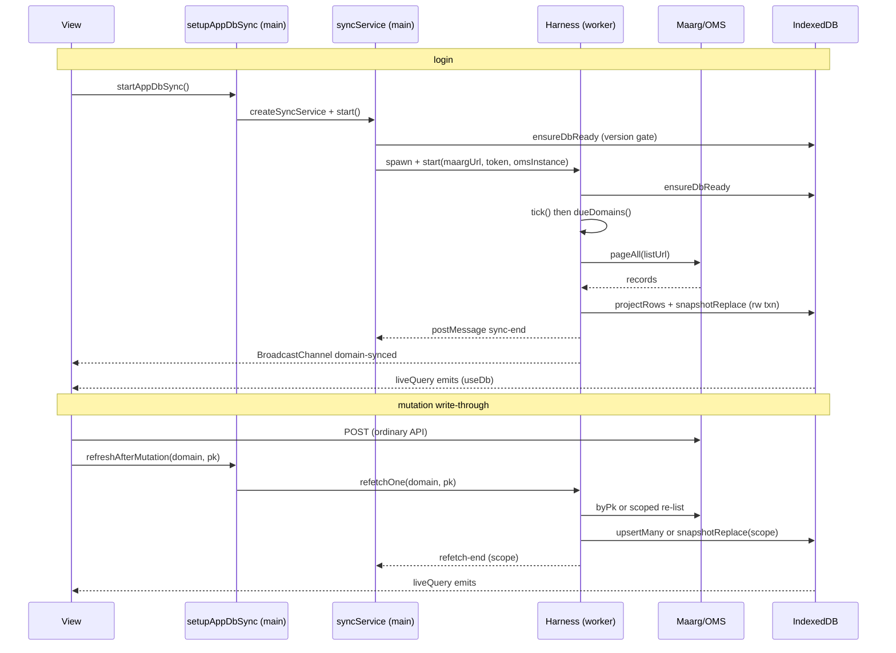

# AccxUI Local Database & Sync — Design

**Status:** Approved
**Version:** 1.2
**Date:** 2026-09-30
**Scope:** `common/db/**`, `common/core/workerRemoteApi.ts`, `common/core/workerFactory.ts`,
`apps/company/src/**`, `apps/order-manager/src/**`
**Companion:** [APP_DB_SYNC_FLOWS.md](APP_DB_SYNC_FLOWS.md) — every flow diagram referenced below.
**How-to:** [APP_DB_DEVELOPER_GUIDE.md](APP_DB_DEVELOPER_GUIDE.md) — recipes for app developers.
**Implementation map:** each section names the module that realizes it. Module and symbol names
rather than line numbers, so the references stay true as the code moves.

---

## 1. Overview

### 1.1 Objective

AccxUI apps render from a **local IndexedDB mirror** of HotWax OMS data rather than from live API
calls. This document specifies how that mirror is declared, created, filled and read:

| Concern | Owner |
|---|---|
| Entity definition (fields + keys + indexes) | `common/db/schema/defineEntity.ts` |
| Schema composition (many entities → one app schema) | `common/db/schema/defineSchema.ts` |
| Database creation (one Dexie DB per OMS instance) | `common/db/schema/defineAppDb.ts` + `common/db/storage/baseDb.ts` |
| Active-database registry | `common/db/schema/appDbRegistry.ts` |
| Async read/write operations | `common/db/storage/dbClient.ts` |
| Raw record → stored row projection | `common/db/storage/projection.ts` |
| Domain definition (how a table is filled) | `common/db/sync/define*Domain.ts` |
| Domain registration + scheduling rule | `common/db/sync/syncRegistry.ts` |
| Worker-side sync runtime | `common/db/sync/pollingWorkerHarness.ts` |
| Main-thread sync lifecycle | `common/db/sync/syncService.ts` + `sync/setupAppDbSync.ts` |
| Reactive read surface | `common/db/composables/useDb.ts`, `useSeedData.ts`, `useDbStatus.ts` |

### 1.2 Problem statement

Describing one entity naturally splits into several parallel declarations — a Dexie `stores()`
string, a projection field list, a sync-domain registration, and a status-card catalog entry — and
nothing mechanically keeps them in agreement. Any one of them can drift from the others, and the
failure mode is silent: an index on an unprojected field is never populated, and a table missing
from a catalog is never synced, with no error at either point.

This design collapses those into **one declaration per entity** (`defineEntity`) and **one
declaration per app** (`defineAppDb`), and *derives* everything else: the Dexie schema string, the
status catalog, and the set of tables the app owns. Drift is then impossible by construction rather
than by review.

### 1.3 Design invariants

1. An index on a field the projection never stores is a **throw at module-evaluation time**
   (`defineEntity.ts`), not a silently empty index.
2. A primary-key member that is not a declared field is a throw (`defineEntity.ts`).
3. Two schemas claiming the same table name is a throw (`defineSchema.ts`).
4. One database per **OMS instance**: `{omsInstance}-{suffix}` (`defineAppDb.ts`). Switching
   instances closes the old handle and opens a different database.
5. The status catalog is derived from the composed tables, so it can never list a table the
   database does not have (`defineAppDb.ts`).
6. Nothing a sync worker imports may pull in `vue`, `commonUtil` or the `@common/db` barrel — Vite
   must emit the worker chunk as a single iife. This constraint is restated in the header of every
   module on that import path.

---

## 2. Scope

### 2.1 In scope

The framework layer in `common/db`, and its two consumers: **Company** (`apps/company`) and **Order
Manager** (`apps/order-manager`).

### 2.2 Out of scope

- `apps/inventory-count` — not a consumer of this design; it declares no app database and runs no
  sync worker.
- Pinia stores, HTTP layer for ordinary (non-sync) reads, auth/token acquisition.
- `common/db/sync/reconciliation.ts` (`CacheReconciliationError`, `cacheScopeKey`) is covered only
  where the sync lifecycle uses it.

---

## 3. Background / Context

### 3.1 Three realms

The design spans three JavaScript realms, and most of its structure follows from that:

| Realm | Holds | Cannot do |
|---|---|---|
| **Main thread** | Vue, Pinia, `commonUtil` (token, OMS instance, Maarg URL), reactive read composables | — |
| **Sync worker** | The poll timer, the domain registry, `fetch`, its own Dexie handles | Read cookies, read `commonUtil`, import `vue` |
| **IndexedDB** | The stored rows, shared by both realms | — |

Because the worker is a separate realm it re-evaluates every module it imports: the domain registry,
the `AppDb` object and the `appDbRegistry` singleton all exist **twice**, once per realm, with
independent state. The worker learns the OMS instance as a `start()` parameter
(`pollingWorkerHarness.ts`) and the bearer token by **push** over a `BroadcastChannel`
(`sync/channels.ts`), never by snapshot.

### 3.2 The worker-bundle constraint

`common/db/index.ts` is a barrel that re-exports `useDb`, `useDbStatus`, `syncService` and
`setupAppDbSync`, all of which import `vue`. Any module a worker entry reaches must therefore use
**deep imports**. The modules on that path state the rule in their own headers:
`schema/defineEntity.ts`, `schema/defineSchema.ts`, `schema/defineAppDb.ts`, `storage/dbClient.ts`,
`seed/seedSchema.ts`, `sync/defineCursorDomain.ts`, `apps/company/src/db/companyDb.ts`,
`apps/order-manager/src/db/orderManagerDb.ts`.

`syncService.ts` states the inverse: it exports a `reactive` object and must **never** be
imported by the worker harness.

---

## 4. Architecture

### 4.1 Layer map



### 4.2 Entity definition — `defineEntity.ts`

One declaration carries all three concerns together: the **projection** (which fields are
stored, and how each is coerced), the **primary key**, and the **secondary indexes**. The Dexie
`stores()` string is *derived* from them (`defineEntity.ts`).

```ts
defineEntity({
  primaryKey: "facilityGroupId,facilityId,fromDate",   // comma-separated, becomes Dexie [a+b+c]
  fields: {                                            // the projection; FieldKind per field
    facilityGroupId: "text", facilityId: "text", fromDate: "date", thruDate: "date",
  },
  indexes: ["facilityGroupId", "facilityId", "thruDate"],
  rename: { toGeoId: "geoIdTo" },                      // stored name to source field name
})
```

**`FieldKind`** (`types.ts`) selects the coercion applied at projection time
(`projection.ts`):

| Kind | Coercion | `undefined` when |
|---|---|---|
| `text` | `String(v).trim()` | null/undefined/empty after trim |
| `count` | `Number(v)` | null/undefined/empty/non-finite |
| `date` | epoch millis — number, numeric string, or `Date.parse` | unparseable |
| `structured` | passed through | empty array, or null/undefined |

**Validation performed at module evaluation** (all throws — see flow `F-ENT` in the flows document):

| Rule | Line |
|---|---|
| non-empty `primaryKey` | `defineEntity.ts` |
| no repeated PK field | `defineEntity.ts` |
| every PK field is declared in `fields` | `defineEntity.ts` |
| no duplicate index | `defineEntity.ts` |
| index does not restate the key path | `defineEntity.ts` |
| every member of a compound index `[a+b]` is a declared field | `defineEntity.ts` |
| a scalar index is a declared field | `defineEntity.ts` |

The returned `Entity` normalizes the key two ways on purpose: `primaryKey` (scalar **or** array, the
shape Dexie wants) and `primaryKeyFields` (always an array, so callers iterate without a type test).

### 4.3 Schema composition — `defineSchema.ts`

`defineSchema(map, { seed })` keys entities by **IndexedDB store name**, so `schema.stores` maps 1:1
onto `version().stores()` with no table/domain translation in between.



Three combinators, **all non-mutating** — each returns a fresh `AppSchema`, so one framework-owned
schema can be picked from by several apps at once:

- **`pick(tables)`** — subset; throws on an unknown table (`defineSchema.ts`). Seed provenance is
  carried across for the picked tables only (`defineSchema.ts`).
- **`extendIndexes(map)`** — appends extra secondary indexes. Rebuilds through `defineEntity`
  (`defineSchema.ts`) so the added indexes face the *same* validation the entity's own did.
- **`mergeSchemas(...schemas)`** — throws when two schemas claim one table name
  (`defineSchema.ts`).

**`seedTables` is provenance, not naming.** `{ seed: true }` is passed only by `commonSchema`
(`seed/seedSchema.ts`). It exists because an app may legitimately declare its **own** table under a
seed table's name — Company's `statuses` hits `oms/statuses`, the seed one hits `admin/status` — and
deciding by name alone would point the app's table at the wrong endpoint (`defineSchema.ts`).
`defineAppDb` filters the status catalog on this set (`defineAppDb.ts`).

`"syncMeta"` is rejected as a declared table (`defineSchema.ts`) — `BaseDB` injects it.

### 4.4 Database creation — `defineAppDb.ts` + `baseDb.ts`

`BaseDB extends Dexie` does three things (`baseDb.ts`): appends `syncMeta: "key"` to the schema
map, records the combined table-name list, and declares `version(n).stores(...)`.

`defineAppDb(def)` returns an `AppDb` facade:

| Member | Behavior |
|---|---|
| `name(oms)` | `` `${oms}-${suffix}` ``; throws on an empty instance (`defineAppDb.ts`) |
| `get(oms)` | Memoizes one handle; on a different name **closes the previous handle** so a `liveQuery` still holding it stops serving the old tenant (`defineAppDb.ts`) |
| `setOmsInstanceResolver(fn)` | Registered once per **realm** at boot |
| `raw()` | `get(resolver())`; throws if no resolver is registered (`defineAppDb.ts`) |
| `client()` | Returns **one** late-binding `DbClient` built from `raw`, not from a handle |
| `entity(table)` | `client().entity(table)` |
| `schema` / `entities` / `tableNames` / `seedTables` | The composed declaration, read-only |
| `statusCatalog` | Derived: composed tables ∩ `seedTables` ∩ `commonDomainsByTable` |

**Late binding is load-bearing** (`defineAppDb.ts`). A domain may hold its entity client in a
module-scope const created at *import* time — before `start()` names the instance — as Company's
hand-written domains do. The client is therefore built from the `raw` resolver rather than from a
handle, so every operation resolves the live database. Capturing a handle instead would pin such a
caller to the handle `get()` closes on an instance switch, and every later read would fail with
`DatabaseClosedError`.

`defineAppDb` calls `setAppDb(appDb)` as its last act (`defineAppDb.ts`) — see §4.5.

**Schema evolution** — one knob, one rule: **a database recording a different `version` than the
build declares is dropped and rebuilt.** Not migrated.

This is safe because nothing stored here is authoritative. Every row is re-derivable from the OMS,
so rebuilding costs a resync — roughly what a login already costs — while migrating in place buys a
database that may hold rows written by an older projection, which is a silent state.

One rule therefore covers every kind of change, which is the point: a new table, an added or removed
index, a changed primary key, a changed `fields` map, a changed `rename`. Bump `version` for any of
them. There is no distinction left to reason about between changes Dexie can carry in place and
changes that leave rows the new code cannot read.

`ensureDbReady` enforces it (`baseDb.ts`): open the database, compare `syncMeta.schemaVersion`
against `BaseDB.declaredVersion`, and on a mismatch `close → Dexie.delete → open → record`. An
absent marker counts as a mismatch, so installs predating it land on a known state; so does a
*lower* declared version, which is what a rolled-back deploy looks like. It never throws — a failed
check must not block boot.

**Where the gate sits.** Every read and write reaches `ensureDbReady`: `dbClient` awaits it before
each operation (`dbClient.ts`), the worker harness on start, the status card on each recompute.
So no query runs, and no `liveQuery` subscribes, against an unverified database — which is what
makes the rebuild safe, since `Dexie.delete` blocks on open connections and by construction there
are none. The version check is memoised per database name, so it costs one resolved await after the
first call; the *open* is deliberately not memoised, so a connection closed later (an OMS switch, or
another tab's `versionchange`) is reopened rather than answered "ready".

**The knob is unguarded, by choice.** Nothing detects a FORGOTTEN bump: the schema changes, the
version does not, and rows keep the previous build's shape with no error anywhere. Bumping `version`
is therefore part of changing the schema, not a separate step to remember afterwards — the review
checklist for any change under `defineEntity`/`defineSchema` is "did the version move?".

`syncMeta` carries three marker families:

| Key | Written by | Read by |
|---|---|---|
| `schemaVersion` | `ensureDbReady` | `ensureDbReady` |
| `loginSync:{domain}` | `markSyncedThisLogin` (`baseDb.ts`) | the once-per-login guard; the status card |
| `domain:{domain}` | an app writing its own per-domain stamp | the status card, in preference to `loginSync:` (`useDbStatus.ts`) |

Logout's `clearDatabaseTables` deletes every row except `schemaVersion`. The version check is
memoised per realm and the sync worker is a realm of its own, so the worker the next login starts
would take a database emptied of its marker for an unrecorded build, and rebuild it under whatever
the main thread had already written.

### 4.5 The app-db registry — `appDbRegistry.ts`

A 14-line module-scope singleton: `setAppDb(db)` / `getAppDb()`, the latter throwing if nothing is
registered. It is the **seam that breaks the import cycle** between the framework's generic domain
factories and the app's concrete database:



Consequences worth stating explicitly:

- The registry holds **one** app db. An app defines exactly one, which is what this seam assumes.
- It is **per realm**. The worker's copy is populated when the worker entry imports the app db
  module; the main thread's copy when `main.ts` does.
- The generic factories therefore need no `getDb` argument. They accept an optional one
  (`defineSnapshotDomain.ts`) and default to `getAppDb().get(omsInstance)`.

### 4.6 Operations layer — `dbClient.ts`

`dbClient(source, schemaEntities?)` accepts a `BaseDB` **or a resolver for one**; a resolver makes
every operation late-binding (`dbClient.ts`). `EntityClient` instances are memoized per table.

The second argument is the composed schema's entity map, which `defineAppDb` supplies
(`defineAppDb.ts`). It is what `upsertMany` and `snapshotReplace` project through: the entity
declaration is a property of the SCHEMA, not of the Dexie handle, so a client built without it
cannot write — those two methods throw rather than silently storing the raw server record.

| Group | Methods |
|---|---|
| Reads | `get`, `getMany`, `all`, `query`, `first`, `count` |
| Writes | `put`, `bulkPut`, `remove`, `bulkRemove`, `clear` |
| Reactive | `live(options)` returning a Dexie `Observable` |
| Sync-shaped | `upsertMany`, `snapshotReplace`, `newestCursor`, `rowsMissing` |

`buildQuery` (`dbClient.ts`) translates `QueryOptions` into a Dexie `Collection` with a fixed
precedence: `scope` → first key of `equals` → `dateField` range → whole table; then `order === "desc"`
reverses, then `filter` (in-memory), then `limit`. Only the *first* `equals` key reaches the index;
`newestCursor` and `defineCachedEntity.count` narrow the rest in memory.

`newestCursor` (`dbClient.ts`) prefers a compound index `[scope+equals...+dateField]` when the
table actually declares it — checked by name against `tableRef.schema.indexes` — and otherwise falls
back to reading the scope and folding with `newestValue`.

### 4.7 Projection — `projection.ts`

Deliberately free of Dexie and Vue, so every rule is unit-testable without IndexedDB.

`projectRow(raw, entity, now)` (`projection.ts`):

1. For each declared field, read `raw[field]`, or `raw[rename[field]]` when the field is absent
   (`projection.ts`) — the fallback is per-field, so a source that already uses the stored name
   wins over the rename.
2. Coerce by `FieldKind`; drop `undefined` results.
3. Return `null` when **any** PK member failed to project — an unkeyable record cannot be stored.
4. Emit `{ ...row, syncedAt: now }` — the declared fields and nothing else. The untouched
   server payload is deliberately not kept alongside them: storing both doubles every row, and a
   field a screen needs belongs in `fields`, where the schema can index and coerce it.

Supporting helpers:

- `canonicalKey` joins a compound key on the NUL character, because `|` occurs in real OFBiz ids
  (`projection.ts`).
- `diffStaleKeys(existing, fresh)` compares through `canonicalKey` but returns the **original** key
  form, so the result goes straight to `bulkDelete` (`projection.ts`).
- `isUnkeyableFetch` is the snapshot safety valve: records came back but none can be keyed.
- `keepNewerThan` / `newestValue` support cursor domains.
- `isEffectiveNow` implements Moqui's `fromDate`/`thruDate` association lifetimes.

### 4.8 Domain definition

A `SyncDomain` (`types.ts`) is `{ name, table?, label, syncClass, intervalMs?, sync, refetchOne? }`.

**Sync classes** (`types.ts`):

| Class | Meaning | Cadence | Filled by |
|---|---|---|---|
| **A** | Live, append-mostly. Polled while a view that needs it is open. | `intervalMs` | `defineCursorDomain`, or a hand-written `defineSyncDomain` |
| **B** | Reference/config. Once per login, then only on mutation. | none | `defineSnapshotDomain` |
| **C** | Write-through only. Never ticked, still listed and refetchable. | none | hand-written |

**Argument order is a documented hazard** (`types.ts`): `refetchOne(ctx, pk, args)` takes the
context **first**, like `sync`, because the harness holds one context and hands it to whichever
domain is due and cannot tell a factory-built domain from a hand-written one. A mismatch is silent —
the domain reads its key fields off the context (all `undefined`) and issues the request with the
primary key where the token belongs, *after* the mutation has already succeeded.

#### 4.8.1 `defineSnapshotDomain` — class B

Fetch the **complete** set, then replace: upsert the fresh rows and prune everything in scope the
fresh set no longer contains. Config (`defineSnapshotDomain.ts`) covers list URL, envelope key,
paging, a fan-out, and two mutually exclusive refetch strategies.

| Option | Effect |
|---|---|
| `listUrl`, `listParams` | the list request |
| `collectionKey` | `null` = bare array; a string = `resp[key]`; omitted = "first array value" guess |
| `strictCollection` | throw on an unrecognized envelope instead of degrading to `[]` |
| `batchSize` (default 250), `unpaged` | paging |
| `fanOut` | one request per parent row, stamping the parent key onto each child |
| `byPk` + `byPkRecordKey` | refetch one record by a dedicated route |
| `refetchScope` | refetch by re-listing one filtered slice and snapshot-replacing that scope |
| `scopeOnSync` | restrict the snapshot's prune to one partition |
| `projection` | explicit `Entity`; defaults to `getAppDb().entities[table]` |

`requireComplete` is **not** a factory option. It belongs to `pageAll` (`workerRemoteApi.ts`), and
the factory never sets it, so a snapshot walk that hits the page backstop warns and carries on. A
hand-written snapshot pass should pass it itself (see F-PAGE).

Two guards protect against wiping a populated table (see flow `F-SNAP`):

1. **Unkeyable fetch** — records returned but none keyable, so abort and write nothing
   (`defineSnapshotDomain.ts`).
2. **Empty fetch over a populated table** — refuse to snapshot-replace on an auto sync
   (`defineSnapshotDomain.ts`).

`defineCachedEntity(db, table, entity)` (`sync/cachedEntity.ts`) is the worker-side write
helper the factories share. Unlike `EntityClient`, it is handed the `Entity` explicitly, so its
`snapshotReplace` / `upsertMany` always project. Its `snapshotReplace` runs the prune and the write
inside **one** `rw` transaction over `[table, "syncMeta"]`.

#### 4.8.2 `defineCursorDomain` — class A

The counterpart: fetch only the slice newer than what is stored, and upsert it. **Nothing is ever
pruned**, so a soft failure cannot empty a table (`defineCursorDomain.ts`).

The distinguishing behavior is the **shallow-window deepening** (`defineCursorDomain.ts`):

```text
cached    = count(scope, narrow)
isShallow = cached < total            # target depth, default 100
cursor    = isShallow ? undefined : newestCursor(cursorField, scope, narrow)

pageNewestFirst(total  = isShallow ? total : batchSize,
                params = { ...paramsOf(args), ...narrowOf(args),
                           [cursorParam]: ISO(cursor),     # only when not shallow
                           orderByField: "-" + cursorField },
                keep   = cursor ? keepNewerThan(page, cursorField, cursor) : undefined)
```

Without this, a cursor plus `keep` stops paging at the first already-cached row on page 0 every tick,
so the window never grows past whatever the first empty-scope fetch happened to collect.

#### 4.8.3 `defineSyncDomain` — hand-written

A pass-through constructor (`defineSyncDomain.ts`) for domains whose fetch logic does not fit
either factory. Company uses it for all 19 of its class-A domains (no app uses
`defineCursorDomain` today), typically running **two passes per tick**:
an incremental "created since cursor" pass, plus a bounded "re-fetch rows that have not settled"
pass (`dataManagerLogDomain.ts`).

Those hand-written domains hold their table access as `companyDb.entity("…")` in module scope —
the late-binding client of §4.4.

#### 4.8.4 The seed catalog — `seed/seedDomains.ts`

29 class-B snapshot domains over the 29 `commonSchema` tables, keyed by domain name, plus two derived
exports used elsewhere: `commonDomainsByTable` (the status-catalog join, `seedDomains.ts`) and
`COMMON_TABLE_NAMES` / `COMMON_DOMAIN_NAMES`.

Three shapes appear:

- plain list (`status`, `enum`, `geo`, and most of the rest);
- list plus `byPk` refetch (`productStore`, `facility`);
- list plus `fanOut` over `productStores` (`productStoreFacility`, `productStoreFacilityGroup`,
  `productStoreShipmentMethod`), where `refetchOne` re-lists and snapshot-replaces just that
  parent's slice (`defineSnapshotDomain.ts`).

### 4.9 Domain registration — `sync/syncRegistry.ts`

A module-scope `Map<name, SyncDomain>`. `registerSyncDomain` / `registerDomains` write to it;
`getSyncDomain`, `getAllSyncDomains`, `registeredDomainNames` read it. **Registration happens at
worker module-evaluation time**, in the worker entry file, before `expose()`.

Note the two-step separation the factories preserve: `defineSnapshotDomain` **builds** a domain;
`registerSnapshotDomain` builds *and* registers. `seedDomains.ts` only builds — each app chooses
which of the 29 to register.

The registry also owns the **pure scheduling rule**:

- **`activationKey(active)`** (`syncRegistry.ts`) — the key a domain's last-run clock is stored
  under. It is `name` plus a **stable stringification of the args**, *not* the name alone. One page
  can activate the same domain several times with different args and different cadences. Keyed on
  name alone they would share one clock, the fastest activation would restamp it every tick, and a
  slower one's interval could never elapse — with no error, because the first tick does run it.
- **`effectiveInterval`** — explicit `ActiveDomain.intervalMs` override, else the domain default.
- **`dueDomains(active, lastRunAt, now, intervalFor)`** (`syncRegistry.ts`) — no cadence means due
  only if never run (activation bootstrap); a cadence means due when the interval has elapsed since
  that *activation* last ran. Pure, so the rule is testable without a worker or a timer.

### 4.10 Sync runtime

#### 4.10.1 Worker side — `pollingWorkerHarness.ts`

Owns the parts an app dev must not get wrong (`pollingWorkerHarness.ts`): the poll cadence on the
worker's own event loop, the held bearer token, and teardown of the single timer. One base tick
(default 5 s) runs whichever activated domains are due, so N domains share one thread and one token
subscription.

`start(payload)` builds `ctx`, defaults `active` to **every registered class-B domain** when the
caller names none (`pollingWorkerHarness.ts`), runs `ensureDbReady`, clears `lastRunAt`, runs one
tick immediately, then `setInterval(tick, baseTickMs)`.

**Concurrency control** — three structures, because a poll tick and a post-mutation refetch can
target one domain at once:

| Structure | Purpose |
|---|---|
| `domainExclusiveQueues` | a domain's `sync` waits for its prior exclusive **and** all in-flight shared ops |
| `domainSharedOperations` | concurrent `refetchOne`s for one domain, which only block the next `sync` |
| `refetchQueues` keyed `domain:scope` | two refetches of the same PK serialize |

**`lastRunAt` stamping is deliberate, not incidental** (`pollingWorkerHarness.ts`): a run is
stamped when it was forced, when the activation has a cadence, or when the domain actually recorded
`loginSync:`. Otherwise the clock is left unset and the tick reports `retryPending: true`, so a
class-B domain that returned nothing is retried on the next tick rather than marked done.

Messages the worker emits — `postMessage` for status, `BroadcastChannel(DB_SYNC_CHANNEL)` for
"rows changed":

| `postMessage` | When |
|---|---|
| `sync-start` | before a domain's `sync` |
| `sync-end` `{domain, written, at, retryPending}` | after a successful `sync` |
| `sync-error` `{domain, scope?, message}` | a failed `sync` or refetch, or an unregistered domain |
| `refetch-end` `{domain, scope, written}` | after a successful `refetchOne` |
| `auth-error` | a refetch failure classified 401/unauthorized |

| `BroadcastChannel` | When |
|---|---|
| `{type: "domain-synced", domain}` | after each successful domain sync |
| `{type: "sync-complete"}` | at the end of every tick |

#### 4.10.2 Main thread — `sync/syncService.ts`

`createSyncService(opts)` owns the worker lifecycle: idempotent `start()` (a second overlapping call
awaits the same in-flight attempt rather than spawning a second worker — App.vue mounts race),
`ensureDbReady` *before* the worker exists to race it, spawn via `WorkerFactory` (Comlink-wrapped),
publish the token at start and then every `tokenWatchMs` (default 15 s), route `auth-error` to the
app's hook, and mirror every status message into the reactive `serviceState`.

A **`startGeneration` counter** (`syncService.ts`) is bumped on every `start()`/`stop()` so a
terminated attempt's last queued worker message — posted before teardown, delivered after — is
ignored rather than mutating state past that teardown.

`serviceState` is the reactive status object every main-thread reader shares:

| Field | Written on | Meaning |
|---|---|---|
| `running` | `start()` / `stop()` | a start attempt is in flight |
| `lastSyncAt` | `sync-end`, successful `start()` | global; moves when *any* domain finishes |
| `syncedAt[domain]` | `sync-end`, `refetch-end` | per domain: the `at` the worker stamped on its last completed pass |
| `written[domain]` | `sync-end`, `refetch-end` | rows written by that pass |
| `errors[domain]` | `recordSyncError` / `clear*Error` | the visible message per domain (see below) |

`syncedAt` exists because a screen asking "has *my* domain been fetched for this shop yet?" cannot
answer that from `lastSyncAt`, which any other domain can move. `serviceState` is a Vue `reactive`,
so a `computed` reading `syncedAt[name]` before the key exists still tracks it and re-runs when the
worker first writes it.

Error bookkeeping distinguishes **domain-level** from **PK-scoped** failures (`syncService.ts`):
a successful full snapshot clears the whole domain, while a targeted `refetch-end` clears only its
own scope, because a message carrying no scope cannot prove some other failed scope recovered.
`recordSyncError`, `clearDomainErrors` and `clearScopeError` are exported so that every writer —
the worker status stream, a failed `start()`, a failed post-mutation refetch — goes through the one
set of maps rather than keeping a parallel copy.

#### 4.10.3 App facade — `sync/setupAppDbSync.ts`

What an app actually imports. The app calls it once, in `src/services/appDbSync.ts`, with
`{ db, getWorkerUrl, createSyncService, onStatus? }`, and re-exports what it returns. That module
owns the one service handle, so it also owns the domain set that handle is polling.

**Lifecycle and reconciliation**

| Export | Behavior |
|---|---|
| `syncService()` | The live `SyncService`, or `null` before start / after a failed start |
| `startAppDbSync(onSynced?)` | Idempotent (own `starting` promise plus `startGeneration`); creates the service, starts it, records `__start` failures |
| `stopAppDbSync()` | Stops the service, closes the `useSeedData` live tables (`clearSeedTables`), and **clears every data table** (`setupAppDbSync.ts`) |
| `refreshAfterMutation(domain, pk)` | `whenReady()` then `service.refetchOne`; any failure is wrapped in `CacheReconciliationError` |
| `resyncDomain(domain)` | Deletes `loginSync:{domain}` then `syncDomainNow` |
| `resyncReferenceData()` | Deletes every `domain:` / `loginSync:` marker, then `syncNow` |
| `syncNow()` | Forces a pass over whatever is currently active. Clears no markers — the cheap "refresh what is on screen" |
| `bootstrapState` | `reactive` view over `serviceState` (running / written / errors) |

**View-scoped activation** (replaces the former Company composable `useDbSync`)

| Export | Behavior |
|---|---|
| `createSyncDomainOwner(label)` | Returns a distinct owner id, `` `${label}:${n}` ``, for one screen **instance** |
| `activateSyncDomains(domains, owner)` | Records `owner` as the holder, stores the set, clears stale errors for those domains, then `service.setDomains(domains)`. Idempotent — call again to re-scope |
| `deactivateSyncDomains(owner?)` | Clears the set and calls `setDomains([])` — but **only if `owner` still holds the worker**. No owner means an unconditional clear |
| `syncDomainsReady` | `Ref<boolean>`: true once the latest activation's `setDomains` resolved (or immediately when there is no service) |
| `syncDomainsError` | `ComputedRef<string>`: the error of an *activated* domain, or `""` |

The rules the activation half enforces:

- **One worker, one active set.** The set is module-scoped inside `setupAppDbSync` and not
  exported. Two features that need to poll together on one screen compose one domain list and
  activate it once (Company's `useShopify` does this); two separate activations would overwrite
  each other.
- **Teardown is keyed on the owner, not the domain set.** Ionic fires `didLeave` on the outgoing
  view *after* `willEnter` on the incoming one, so the old view's teardown routinely runs when the
  new view already holds the worker. Without the check it would wipe the new view's domains, and
  the new view would poll nothing. The check compares owners rather than sets because a screen's
  own set changes while it is open (`ShopifyProductSync` re-activates as job names resolve), so a
  set comparison would reject that screen's own teardown and leave its polling running.
- **Owners are per instance, not per component.** Several routes share one component and navigate
  between each other, and two order-sync sessions share one feature id. If two live instances had
  the same owner string the guard would do nothing. So each instance calls
  `createSyncDomainOwner` once, at setup.
- **Late RPCs cannot resurrect a torn-down set.** An `activationGeneration` counter is bumped on
  every activation and every accepted deactivation. An activation whose `setDomains` resolves after
  a newer call returns without flipping `syncDomainsReady` back on. This is the same pattern as
  `startGeneration`.
- **Errors are scoped to the active set.** `syncDomainsError` reads `serviceState.errors` only for
  the activated domains, so a background domain's failure cannot show a banner on an unrelated
  screen. It is the *last* failing domain in the caller's array order, not the newest failure,
  because `serviceState.errors` has no timestamps. Activation also clears those domains' errors
  first, so a screen does not inherit a failure recorded while another screen held the domain.

There is no `onUnmounted` safety net: these are plain functions, and no Vue component lifecycle
enters `common/`. A view that activates must deactivate with its own owner in `onIonViewDidLeave`.

`CacheReconciliationError` (`sync/reconciliation.ts`) carries `mutationCommitted = true`.
Keeping that stage explicit prevents a retry from duplicating a create or replaying a date-effective
association write: the server change *did* land, only the local reconciliation failed.

### 4.11 Read surface

| Composable | Shape | Notes |
|---|---|---|
| `useDb(table, options?)` | `{ records, first, count, hydrated, error }` | One entry point, always a list; `first` is a computed, because reading one row through `equals` on the PK is the same index lookup `get()` does. Re-subscribes on any options change (`deep: true`), unsubscribes on unmount. |
| `useSeedData()` | reactive getters (no prefix) plus a few async `get*` getters | One Dexie `liveQuery` per seed table, keyed by database name and table, opened on first use and kept until logout. All callers share it, and it re-emits on any write to the table. Reactive getters (`statusDescription`, `enumsByType`, `countries`, …) are synchronous reads of the table's `shallowRef`, for templates and computeds. Async `get*` getters await the first emission and return the current rows, for stores and code that must act on the rows. Joins happen in memory, and labels fall back to the raw id. Not a Pinia store, and not page-scoped. |
| `useDbStatus(db, catalogSource, actions)` | `{ domains, loaded, refreshing, totalRows, oldestSyncedAt, lastSyncedAt, refreshDomain, refreshAll }` | Drives the Settings card off a `liveQuery` over `syncMeta` plus per-table counts, plus a `DB_SYNC_CHANNEL` listener. |

`hydrated` (`useDb.ts`) is `emitted && (records.length > 0 || !serviceState.running)` — that is
what lets a view distinguish "the seed sync has not finished yet" from "this table is genuinely
empty", and it is the only reason `serviceState` is reactive.

`useSeedData` has no such flag: a table's first render answers with the raw id or `[]` until its
first read lands. Company's `useSeed.ts` wrappers rebuild `hydrated` on top of it with the same
formula (the async getter has resolved, and there are rows or `serviceState.running` is false).
`clearSeedTables()` unsubscribes every live table; `stopAppDbSync` calls it on logout. The OMS
instance cannot change without logout, so there is no per-instance eviction.

`useDbStatus` accepts **either** a static `SyncDomainCatalogItem[]` or a function returning the
worker's registry-derived catalog over Comlink, resolving the async form once and re-subscribing when
it goes from empty to populated (`useDbStatus.ts`). The per-domain `status` is
`count > 0 ? "success" : (syncedAt || syncClass === "A" ? "empty" : "none")`.

---

## 5. Per-app instantiation

### 5.1 Company (`apps/company`)

| Piece | File |
|---|---|
| Own schema — **48 tables** | `src/db/companySchema.ts` |
| Database — 17 picked seed tables plus its own 48 (65 data tables), schema `version: 3` | `src/db/companyDb.ts` |
| Worker entry — registers 24 seed plus 22 hand-written plus 26 reference domains (72 total) | `src/workers/appSync.worker.ts` |
| Hand-written domains | `src/workers/domains/*.ts` (15 files, plus `referenceDomains.ts`; ~2 600 lines together) |
| App-owned sync policy | `src/config/appSyncConfig.ts` |
| Main-thread facade, including view-scoped activation | `src/services/appDbSync.ts` |
| Per-view class-A activation call sites | `views/NetSuite.vue`, `ShopifyProductSync.vue`, `ShopifyInventorySync.vue`, `ShopifyFulfillmentSync.vue`; `composables/useShopify.ts`, `useProductStoreOnboardingInitialLoad.ts` |
| Read composables | `src/composables/useSeed.ts` (seed lookups are thin wrappers over `useSeedData`; its own tables stay on `useDb`), `useSystemMessage.ts`, `useAppVersion.ts` |

```ts
// src/db/companyDb.ts
export const companyDb = defineAppDb({
  suffix: "CompanyDB",
  version: 3,   // v2: shopifyLocationInventory* stores; v3: inventory ledger / fulfillment re-key
  schema: mergeSchemas(commonSchema.pick([...COMPANY_SEED_TABLES]), companySchema),
});
companyDb.setOmsInstanceResolver(() => "default");   // test/fallback; main.ts replaces it
```

Notable app-level choices:

- **Overrides rather than seed reuse.** `carrier`, `carrierShipmentMethod`, `shopifyShop`,
  `facilityGroups` and `statuses` are re-declared in `referenceDomains.ts` with Company-specific
  `listParams`, `refetchScope`, `strictCollection` and `byPk`, while the *table* still comes from the
  seed schema. The seed domain for those names is simply not registered (`appSync.worker.ts`).
- **The worker registers its own resolver** (`appSync.worker.ts`), because Company's hand-written
  domains reach the database through `companyDb.entity(...)`, then `raw()`, then the resolver. Order
  Manager does not need this.
- **Class-A domains are activated per view, with args.** Each screen instance takes an owner
  (`createSyncDomainOwner("netSuiteView")`), calls `activateSyncDomains(domains, owner)` on
  `onIonViewWillEnter` (and again from a `watch` on its scope key, such as `productStoreId`), and
  calls `deactivateSyncDomains(owner)` on `onIonViewDidLeave`. All three functions come from
  `src/services/appDbSync.ts`. `activateSyncDomains` calls `service.setDomains(...)`, which calls
  `harness.setDomains(...)` in the worker. `ShopifyProductSync.vue` is the fullest example: system
  messages per feature type, data-manager logs per import config, the sync-run spine, service-job
  runs scoped to displayed jobs, and `productUpdateHistory` scoped to one shop. The former
  `composables/useDbSync.ts` wrapper has been deleted (see
  `docs/superpowers/specs/2026-09-21-remove-usedbsync-design.md`).
- Screens read per-domain freshness from `serviceState.syncedAt[domain]` (for example
  `ShopifyTransferSync`'s "loaded" gate) and show a banner from `syncDomainsError`.
- `appSyncConfig.ts` encodes the rule the machinery cannot: **do not poll an arbitrary window of
  transactional data** — a live domain declares a scope (the remotes of the shops this app manages)
  and per-type windows, because one shared newest-N window lets high-volume traffic starve every
  other message type out of it.
- Every mutating composable ends with `refreshAfterMutation(domain, pk)` — the write-through path of
  F-MUT, and the only way a server change reaches the local mirror without waiting for a poll.

### 5.2 Order Manager (`apps/order-manager`)

```ts
// src/db/orderManagerDb.ts:30
export const orderManagerDb = defineAppDb({
  suffix: "OrderManagerDB", version: 1,
  schema: commonSchema,          // the whole seed schema; no tables of its own
});
```

- The worker registers **every** seed domain: `registerDomains(Object.values(commonDomains))`
  (`appSync.worker.ts`) — and nothing else. No hand-written domains, no class-A polling.
- No `setDomains` call sites: the harness's default (`payload.domains` omitted means every registered
  class-B domain) is the entire activation policy.
- Named re-exports (`orderManagerDbName`, `getOrderManagerDb`, `setOmsInstanceResolver`, `omDb`) keep
  pre-`defineAppDb` call sites unchanged (`orderManagerDb.ts`).
- The Settings card uses the **static** `orderManagerDb.statusCatalog`; Company uses the async worker
  catalog.
- Reads go almost entirely through `useSeedData()` — around 30 files across components and views
  call its reactive getters straight from templates and computeds, with no watchers. The few places
  that build requests or brokering decisions from seed rows await its `get*` getters.
- `services/appDbSync.ts` re-exports only the lifecycle half of `setupAppDbSync`; with no class-A
  domains it has no use for the activation members.

### 5.3 Inventory Count

No `src/db`, no sync worker. Not a consumer of this framework.

### 5.4 Side-by-side

| | Company | Order Manager |
|---|---|---|
| Seed tables picked | 17 of 29 | all 29 |
| Own tables | 48 | 0 |
| Schema version | 3 | 1 |
| Domains registered | 72 (24 seed, 22 hand-written, 26 reference) | 29 seed |
| Class-A domains | 19 | 0 |
| View-scoped activation | `activateSyncDomains` / `deactivateSyncDomains` with owners | none |
| Worker registers OMS resolver | yes | no (not needed) |
| Status catalog source | async, worker registry | static, `statusCatalog` |
| Main read surface | `useDb`, plus `useSeedData` behind `useSeed.ts` | `useSeedData` |

---

## 6. Data flow summary



Full per-path diagrams — boot, tick scheduling, snapshot, cursor, refetch, paging, concurrency,
teardown — are in [APP_DB_SYNC_FLOWS.md](APP_DB_SYNC_FLOWS.md).

---

## 7. Security & permissions

- The bearer token never crosses a realm boundary by snapshot. The main thread publishes it on
  `BroadcastChannel("accxui:polling-auth-token")` and the worker **holds** the latest
  (`sync/channels.ts`); a rotation is pushed within `tokenWatchMs`, and an `auth-error` from
  the worker triggers an immediate push (`syncService.ts`).
- The worker sends it only as `Authorization: Bearer …` on Maarg requests
  (`workerRemoteApi.ts`).
- Databases are **per OMS instance**, so a tenant switch cannot read the previous tenant's rows; the
  previous Dexie handle is closed so a live subscription cannot keep serving it
  (`defineAppDb.ts`).
- Logout clears every data table (`setupAppDbSync.ts`, via `clearDatabaseTables`) and closes the
  in-memory seed tables (`clearSeedTables`), so the next user reads fresh.
- `CacheReconciliationError` carries the domain and PK as diagnostics only — never credentials or
  response bodies (`sync/reconciliation.ts`).
- A parsed error body is rethrown as-is rather than wrapped, because callers classify auth failures
  by sniffing its message (`workerRemoteApi.ts`).

---

## 8. Verification plan

The framework layer is verified by the following specs under `common/tests/`:

| Spec | Covers |
|---|---|
| `defineEntity.spec.ts` | key normalization and every validation throw |
| `defineSchema.spec.ts` | `pick` / `extendIndexes` / `mergeSchemas`, non-mutation |
| `commonSchema.spec.ts` | the 29 seed entities agree with `COMMON_TABLE_NAMES` |
| `defineAppDb.spec.ts` | naming, handle reuse, status catalog |
| `dbClient.spec.ts` | compound-key pass-through, empty-key short-circuit, resolver late binding |
| `projection.spec.ts` | coercions, unkeyable rows, `diffStaleKeys` |
| `cachedEntity.spec.ts` | `defineCachedEntity` snapshot/upsert/cursor |
| `snapshotDomain.{contract,keys,label}.spec.ts` | envelope handling, key building, labels |
| `cursorDomain.spec.ts` | shallow-window deepening, cursor params |
| `syncRegistry.spec.ts` | `activationKey`, `dueDomains` |
| `syncHarness.spec.ts`, `syncHarness.ordering.spec.ts` | tick, queues, exclusive/shared ordering |
| `ensureDbReady.spec.ts` | open, version-gate rebuild, memoised check |
| `syncService.spec.ts` | idempotent start, generation guard, error routing, `syncedAt` |
| `setupAppDbSync.spec.ts` | activation / owner-guarded deactivation, generation guard, scoped `syncDomainsError` |
| `useDbStatus.spec.ts` | catalog resolution, counts, status derivation |
| `workerRemoteApi.spec.ts`, `workerFetch.spec.ts` | query serialization, paging, empty-body 200 |

---

## 9. Reference — file index

| File | Lines | Role |
|---|---|---|
| `common/db/index.ts` | 32 | barrel (main thread only) |
| `common/db/types.ts` | 78 | `DbRow`, `DbKey`, `FieldKind`, `QueryOptions`, `SyncContext`, `SyncDomain` |
| **`common/db/schema/`** | | **declaring entities, schemas and the app database** |
| `common/db/schema/defineEntity.ts` | 129 | entity declaration and validation |
| `common/db/schema/defineSchema.ts` | 116 | `defineSchema`, `pick`, `extendIndexes`, `mergeSchemas` |
| `common/db/schema/defineAppDb.ts` | 144 | per-app database facade |
| `common/db/schema/appDbRegistry.ts` | 14 | active-app-db singleton |
| **`common/db/storage/`** | | **Dexie access and row projection** |
| `common/db/storage/baseDb.ts` | 167 | `BaseDB`, `ensureDbReady` (open + version gate), login markers |
| `common/db/storage/dbClient.ts` | 345 | `DbClient` / `EntityClient` |
| `common/db/storage/projection.ts` | 169 | coercion, keying, diffing |
| **`common/db/seed/`** | | **framework seed tables and their domains** |
| `common/db/seed/seedSchema.ts` | 307 | `commonSchema`: 29 seed entities |
| `common/db/seed/seedDomains.ts` | 299 | `commonDomains`: 29 seed class-B domains, `commonDomainsByTable`, `COMMON_TABLE_NAMES` |
| **`common/db/composables/`** | | **Vue read surface (main thread only)** |
| `common/db/composables/useDb.ts` | 92 | reactive list read |
| `common/db/composables/useSeedData.ts` | 290 | live seed lookups |
| `common/db/composables/useDbStatus.ts` | 218 | status card |
| **`common/db/sync/`** | | **domains, worker runtime and main-thread lifecycle** |
| `common/db/sync/defineSyncDomain.ts` | 23 | hand-written domain constructor |
| `common/db/sync/cachedEntity.ts` | 104 | `defineCachedEntity`, the worker-side write helper both factories share |
| `common/db/sync/defineSnapshotDomain.ts` | 206 | class-B factory |
| `common/db/sync/defineCursorDomain.ts` | 134 | class-A factory |
| `common/db/sync/syncRegistry.ts` | 104 | registry and scheduling rule |
| `common/db/sync/pollingWorkerHarness.ts` | 317 | worker runtime |
| `common/db/sync/syncService.ts` | 299 | main-thread worker lifecycle, `serviceState`, error maps |
| `common/db/sync/setupAppDbSync.ts` | 327 | app-facing facade, view-scoped activation |
| `common/db/sync/channels.ts` | 44 | `DB_SYNC_CHANNEL` (row-change broadcast) and the token push channel |
| `common/db/sync/reconciliation.ts` | 52 | `CacheReconciliationError`, `isCacheReconciliationError`, `cacheScopeKey` |
| `common/core/workerRemoteApi.ts` | 303 | worker fetch, `pageAll`, `pageNewestFirst` |
| `common/core/workerFactory.ts` | 37 | Comlink worker spawn |
