# AccxUI Local Database & Sync — Flow Diagrams

**Status:** Approved
**Version:** 1.3
**Date:** 2026-10-06
**Companion:** [APP_DB_ARCHITECTURE.md](APP_DB_ARCHITECTURE.md) — the prose design; this document is
the diagram set it references.
**How-to:** [APP_DB_DEVELOPER_GUIDE.md](APP_DB_DEVELOPER_GUIDE.md) — recipes for app developers.

Each flow names the module that realizes it beneath the diagram. Module and symbol names rather
than line numbers, so the references stay true as the code moves.
Bare framework file names live under `common/db/` in `schema/`, `storage/`, `seed/`, `composables/` or
`sync/`; the [file index](APP_DB_ARCHITECTURE.md#9-reference--file-index) gives each one's folder.

| Id | Flow |
|---|---|
| [F-ENT](#f-ent--entity-declaration-and-validation) | Entity declaration and validation |
| [F-SCH](#f-sch--schema-composition) | Schema composition (pick / merge / extendIndexes) |
| [F-DB](#f-db--database-creation-and-oms-scoping) | Database creation and OMS scoping |
| [F-BOOT-M](#f-boot-m--main-thread-module-evaluation) | Main-thread module evaluation |
| [F-BOOT-W](#f-boot-w--worker-module-evaluation-and-registration) | Worker module evaluation and registration |
| [F-START](#f-start--login-to-first-sync) | Login to first sync (full sequence) |
| [F-TICK](#f-tick--harness-tick-and-scheduling) | Harness tick and the scheduling rule |
| [F-SNAP](#f-snap--class-b-snapshot-domain-sync) | Class-B snapshot domain sync |
| [F-FAN](#f-fan--fan-out-snapshot) | Fan-out snapshot |
| [F-CUR](#f-cur--class-a-cursor-domain-sync) | Class-A cursor domain sync |
| [F-PAGE](#f-page--pagination) | Pagination (`pageAll` vs `pageNewestFirst`) |
| [F-PROJ](#f-proj--projection-and-snapshot-replace) | Projection and snapshot-replace |
| [F-MUT](#f-mut--mutation-write-through) | Mutation write-through (`refreshAfterMutation`) |
| [F-CONC](#f-conc--worker-concurrency-queues) | Worker concurrency queues |
| [F-ACT](#f-act--per-view-class-a-activation) | Per-view class-A activation (Company) |
| [F-READ](#f-read--read-paths) | Read paths (`useDb`, `useSeedData`, `useDbStatus`) |
| [F-ERR](#f-err--error-and-status-propagation) | Error and status propagation |
| [F-TOK](#f-tok--token-freshness) | Token freshness |
| [F-TEAR](#f-tear--logout-instance-switch-teardown) | Logout, instance switch, teardown |
| [F-APPS](#f-apps--company-vs-order-manager-wiring) | Company vs Order Manager wiring |

---

## F-ENT — Entity declaration and validation

Every branch below throws at **module-evaluation time**, so a bad declaration fails the app's first
import rather than producing a permanently empty index.

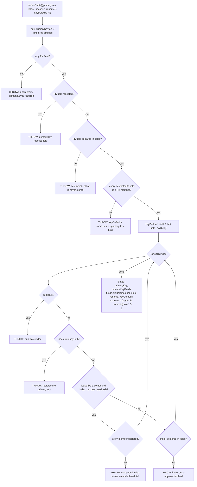

`keyDefaults` gives a stand-in value for a primary-key member the server may legitimately omit (a
document attached to no feed), so the row is stored rather than dropped as unkeyable (see F-PROJ).
`extendIndexes` carries it over when it rebuilds an entity.

Source: `common/db/schema/defineEntity.ts`.
Coercion kinds consumed later by `projectRow`: `common/db/storage/projection.ts`.

---

## F-SCH — Schema composition

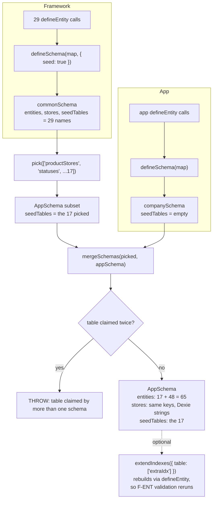

Guards, all in `defineSchema.ts`: `"syncMeta"` may not be declared; `pick` and `extendIndexes` throw
on an unknown table; `mergeSchemas` throws on a collision. All three combinators return fresh
objects and never mutate their input.

**Why `seedTables` is provenance and not a name test:** an app may declare its own table under a seed
table's name (Company's `statuses` hits `oms/statuses`, the seed one hits `admin/status`).
`defineSchema.ts`.

---

## F-DB — Database creation and OMS scoping

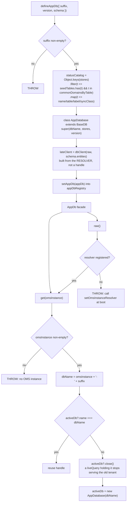

`BaseDB` then appends `syncMeta: "key"` and calls `version(n).stores(combined)`
(`baseDb.ts`).

### Database readiness and the version gate

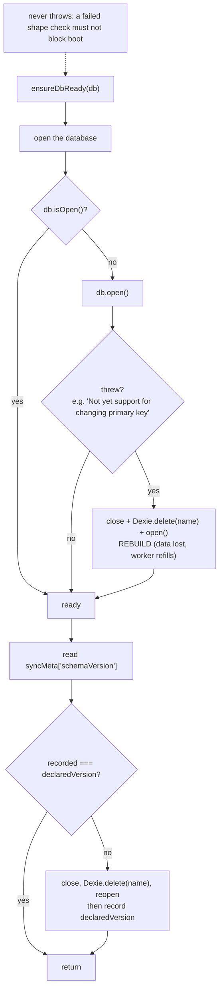

One rule, one knob: a recorded version that differs from the declared one means the database was
built by another build, so it is dropped and rebuilt rather than migrated. That covers a new store,
a dropped index, a changed key path and a changed projection alike. An absent marker and a *lower*
declared version (a rollback) both count as mismatches.

The check is memoised per database name; the open is not, so a connection closed later is reopened.

**Why the gate runs in Dexie's global zone.** Live queries call `ensureDbReady` from inside their
querier (`dbClient.live`, `useSeedData`, `useDbStatus`), where Dexie refuses writes. Dexie also carries
a live query's zone into nearby native continuations. So when a live query was the database's first
use, the check failed with `ReadOnlyError` and never wrote the marker, and the database was rebuilt
on every load. `ensureDbReady` is therefore not an `async` function. It returns a chain of Dexie
promises:

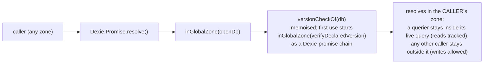

Source: `baseDb.ts`.

---

## F-BOOT-M — Main-thread module evaluation

ES modules evaluate every import before the importing module's body runs. `main.ts` imports
`App.vue` first, and `App.vue` imports `services/appDbSync.ts`, so the database and the sync facade
both exist before `main.ts` registers the live resolver.

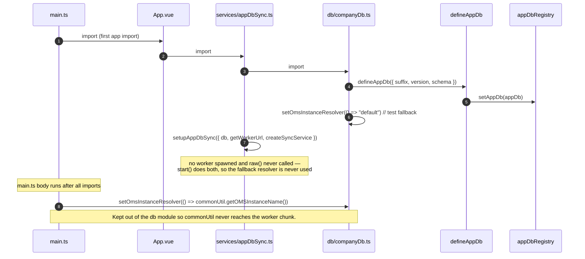

Company: `apps/company/src/main.ts`, `src/App.vue`, `src/db/companyDb.ts`, `src/services/appDbSync.ts`.

Order Manager follows the same order, with two differences (`apps/order-manager/src/main.ts`):

- `db/orderManagerDb.ts` registers no `"default"` fallback resolver.
- The `main.ts` body also calls `registerDomains(Object.values(commonDomains))` on the **main thread**,
  before it sets the resolver. Company's main thread registers no domains.

---

## F-BOOT-W — Worker module evaluation and registration

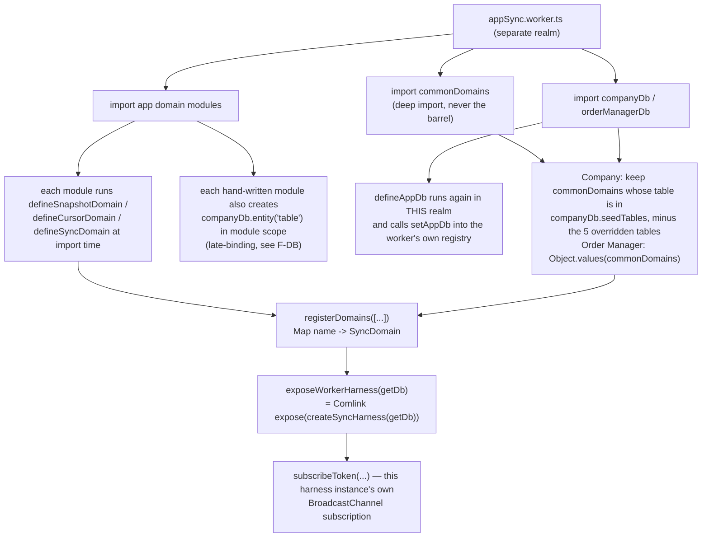

Company additionally rebinds the resolver inside the worker realm, because its hand-written domains
reach the DB through `companyDb.entity(...)` which resolves via `raw()`:

```ts
// apps/company/src/workers/appSync.worker.ts
exposeWorkerHarness((omsInstance) => {
  companyDb.setOmsInstanceResolver(() => omsInstance);
  return companyDb.get(omsInstance);
});
```

Order Manager does not need it. Every one of its domains is factory-built and resolves through
`getAppDb().get(omsInstance)`, which takes the instance as a parameter. Its worker hands the harness
`getOrderManagerDb` (`apps/order-manager/src/workers/appSync.worker.ts`).

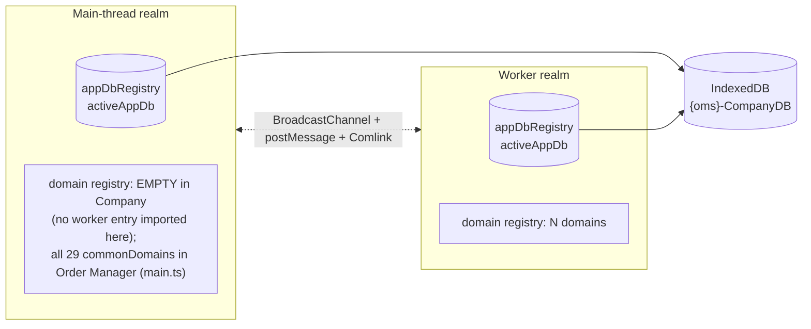

---

## F-START — Login to first sync

### Login starts from an empty database

Both apps' `postLogin` call `stopAppDbSync()` **before** anything else reads the database. The
logout wipe does not always run: a session that expires while nothing is requesting (a closed tab, a
sleeping laptop) lands on `/login` with no 401 and so no `postLogout`. Without this step, the
previous session's rows and its once-per-login markers would still be there, and the next login
would skip the seed. `postLogin` runs once per real login, never on a reload.

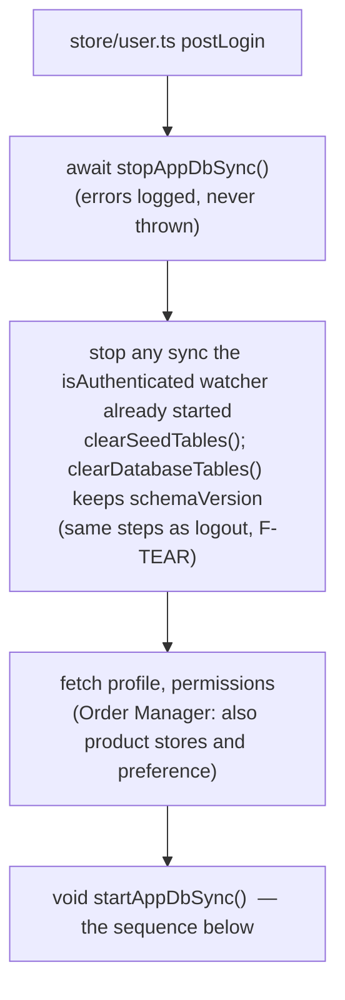

Sources: `apps/company/src/store/user.ts` (`postLogin`), `apps/order-manager/src/store/user.ts`
(`postLogin`).

### Start sequence

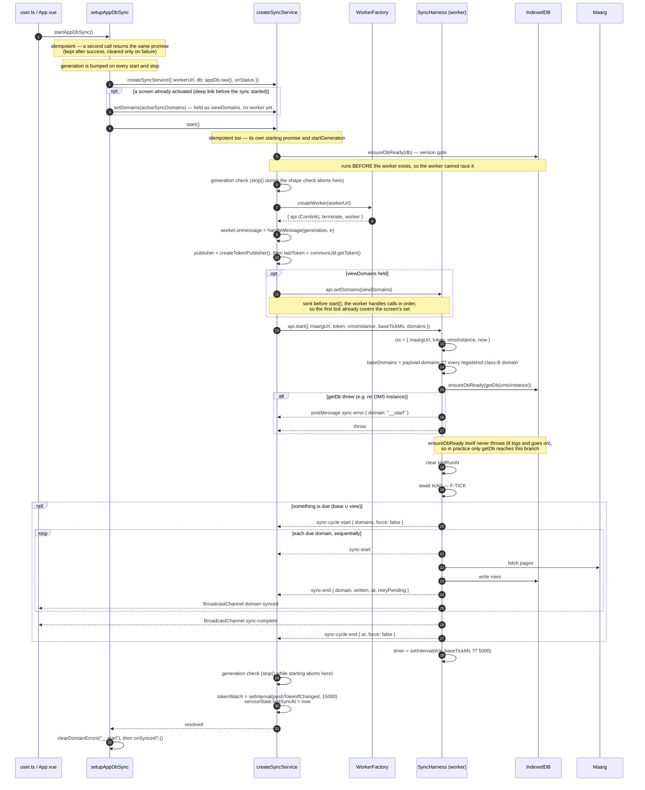

Entry points that call `startAppDbSync()`:

| App | Where |
|---|---|
| Company | `App.vue` (on `isAuthenticated` flipping true), `store/user.ts` (`postLogin`), `useCarriers.ts` (via the `startReferenceSync` alias) |
| Order Manager | `App.vue`, `store/user.ts` (`postLogin`) |

Both paths are safe to fire together — `startAppDbSync` and `SyncService.start` are each idempotent.
The start is driven off a watcher rather than `onMounted` because `isAuthenticated` is false at mount
and flips true a moment later, which an `onMounted`-only start would miss entirely (`App.vue`).

Company's `services/appDbSync.ts` wraps `startAppDbSync` and also calls `deleteLegacyCaches()` once
per page load, best effort.

---

## F-TICK — Harness tick and scheduling

The harness keeps **two activation sets**:

- `baseDomains` is the start set: `payload.domains`, or every registered class-B domain. A screen
  never replaces it.
- `viewDomains` is the set the open screen passed to `setDomains` (F-ACT).

`activeDomains()` is base then view, with duplicates (same `activationKey`) dropped. Three entry
points drive a pass:

| Call | Force | Scope | What it runs |
|---|---|---|---|
| timer / `start()` → `tick()` | no | — | `dueDomains(activeDomains(), ...)` |
| `syncNow()` → `tick(true, true, "view")` | yes | view | every `viewDomains` entry |
| `syncAll()` → `tick(true, true, "all")` | yes | all | every `activeDomains()` entry |

### Admission: share, queue or begin

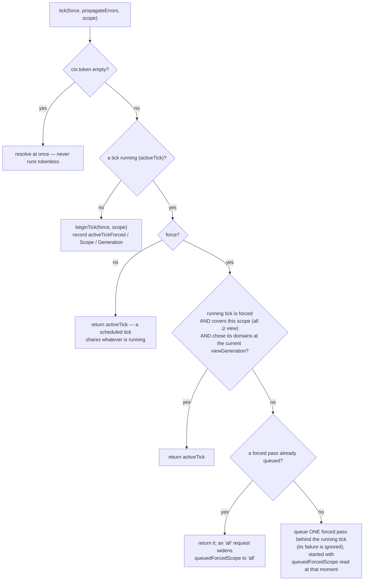

A forced pass never resolves against a pass that skipped its domains. A manual refresh issued
mid-tick, or after `setDomains` changed the screen set, waits and gets its own pass. `setDomains`
bumps `viewGeneration`, which is how a running forced pass is known to be stale.

### One pass

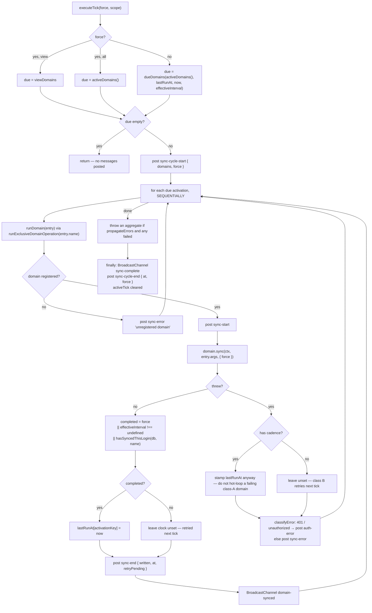

### The `dueDomains` rule

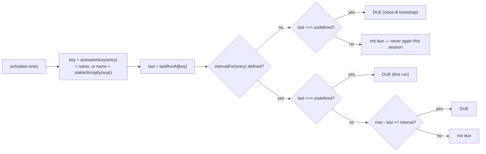

**Why the clock key includes the args** (`syncRegistry.ts`): one page can activate the same domain
several times with different args and different cadences. Keyed on name alone they would share one
clock, and the fastest activation would restamp it on every tick, so a slower one's interval could
never elapse — it would run once on page entry and then never again, with no error, because the
first tick *does* run it.

Source: `pollingWorkerHarness.ts`, `syncRegistry.ts`.

---

## F-SNAP — Class-B snapshot domain sync

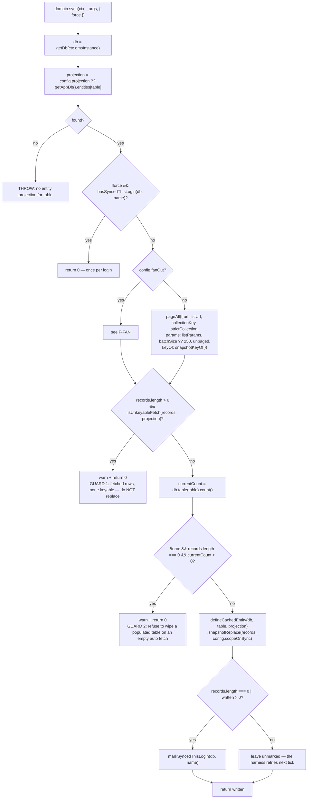

Source: `defineSnapshotDomain.ts`.

Both guards stand down for `force`, which is how every manual path arrives. Each one reaches the
domain as `{ force: true }`, but they cover different sets:

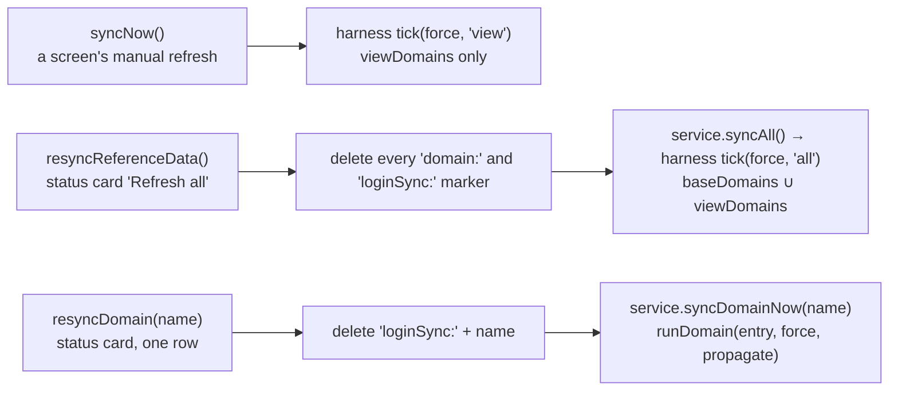

A screen's `syncNow` therefore no longer re-runs the login seed set. `SyncService.syncNow` and
`syncAll` wait for a start already in flight rather than returning without a pass
(`syncService.ts`, `setupAppDbSync.ts`).

---

## F-FAN — Fan-out snapshot

For child collections that only exist under a parent (`productStoreFacilities`,
`productStoreFacilityGroups`, `productStoreShipmentMethods`).

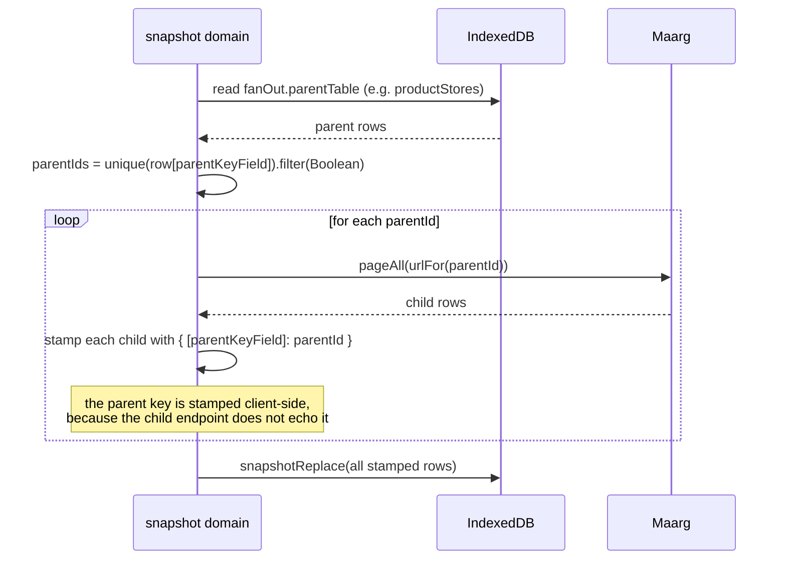

`refetchOne` on a fan-out domain without a `byPk` takes a narrower path. It re-lists **that one
parent** and snapshot-replaces only `{ field: parentKeyField, value: parentId }`, so one store's
slice is refreshed and pruned without touching the others. This check runs **first**, so it wins
over a `refetchScope` the domain also declares. A `pk` without the parent key returns 0, and so does
a fetch whose rows are all unkeyable (`defineSnapshotDomain.ts`).

---

## F-CUR — Class-A cursor domain sync

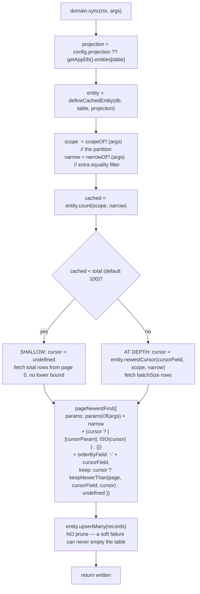

**Why the window is deepened rather than topped up** (`defineCursorDomain.ts`,
`dataManagerLogDomain.ts`): `cursorParam` plus `keep` stops paging at the first already-cached row
— page 0, every tick — as soon as anything is cached. Without the deepening pass, `total` would only
ever apply to an *empty* scope and raising it later would have no effect, so a window seeded shallow
stays shallow. A screen that joins two such windows then sees no overlap between them at all.

Contrast with F-SNAP:

| | class B (`defineSnapshotDomain`) | class A (`defineCursorDomain`) |
|---|---|---|
| Fetch | complete set (`pageAll`) | newest slice (`pageNewestFirst`) |
| Write | `snapshotReplace` — upsert + prune | `upsertMany` — upsert only |
| Cadence | none (bootstrap once) | `intervalMs` |
| Empty response | guarded; refuses to wipe | writes nothing, harmless |
| Activation | default: all registered class-B | explicit `activateSyncDomains` from a view |

---

## F-PAGE — Pagination

```mermaid
flowchart TD
    subgraph pa["pageAll — complete set (class B)"]
      A0{"unpaged || batchSize === 0?"}
      A0 -- yes --> A1["one request with pageSize = viewSize = batchSize || 250<br/>(Moqui defaults to 20 and would truncate silently)"]
      A0 -- no --> A2["pageIndex = 0"]
      A2 --> A3["GET with pageIndex/pageSize + viewIndex/viewSize"]
      A3 --> A4{"strictCollection?"}
      A4 -- yes --> A5["assertCollectionShape — THROW on an unexpected envelope"]
      A4 -- no --> A6["unwrapCollection"]
      A5 --> A6
      A6 --> A7{"rows empty?"}
      A7 -- yes --> AEND["stop"]
      A7 -- no --> A8["key = keyOf ? keyOf(row) : JSON.stringify(row)<br/>keyed: dedupe into seenKeys, a new key counts as new<br/>unkeyable (keyOf → undefined): kept AND counted as new"]
      A8 --> A9{"rows.length < batchSize?"}
      A9 -- yes --> AEND
      A9 -- no --> A10{"newKeys === 0?"}
      A10 -- yes --> AWARN["requireComplete ? THROW : warn — endpoint ignores pageIndex"]
      A10 -- no --> A11["pageIndex++"]
      A11 --> A12{"pageIndex >= maxPages (40)?"}
      A12 -- yes --> AWARN2["requireComplete ? THROW : warn — TRUNCATED at the backstop"]
      A12 -- no --> A3
    end

    subgraph pn["pageNewestFirst — newest slice (class A)"]
      B1["collected = []; pageIndex = 0"]
      B1 --> B2{"pageIndex < maxPages && collected.length < total"}
      B2 -- no --> BEND["return collected.slice(0, total)"]
      B2 -- yes --> B3["GET pageSize=batchSize, pageIndex"]
      B3 --> B4{"page empty?"}
      B4 -- yes --> BEND
      B4 -- no --> B5{"keep provided?"}
      B5 -- yes --> B6["fresh = keep(page); push fresh"]
      B6 --> B7{"fresh.length < page.length?"}
      B7 -- yes --> BEND2["crossed into already-cached rows — stop"]
      B7 -- no --> B8
      B5 -- no --> B8{"page.length < batchSize?"}
      B8 -- yes --> BEND
      B8 -- no --> B2
    end
```

Unkeyable rows count as progress so that a walk over them does not stop after one page with a false
"ignores pageIndex" warning. Without a `keyOf`, the row's own JSON is its identity.

`requireComplete` is opt-in, and `defineSnapshotDomain` does **not** set it. So a snapshot built from
a walk cut short by the backstop or by an endpoint that ignores `pageIndex` only warns, and the
snapshot-replace that follows prunes rows the walk never reached. Today only Company's
`shopifyTransferSyncDomain` passes `requireComplete: true`.

Two request-shaping details in `workerRemoteApi.ts` worth keeping visible:

- **Array params expand into repeated keys:** `{ id: ["A","B"] }` becomes `id=A&id=B`.
  `new URLSearchParams(params)` comma-joins instead, which Moqui reads as one literal value, so the
  request 200s with an empty list and the failure is silent. Axios (main thread) expands by default,
  which is why the same query works from a store and fails from a worker.
- **An empty 200 is not an error:** some Moqui list routes answer with no body at all, and
  `response.json()` throws `SyntaxError: unexpected end of input`. Only that exact message is
  swallowed; a real parse failure (an HTML error page) still propagates.

Base-URL rewriting: a bare instance name becomes `https://{name}.hotwax.io/`. Then `oms/` and
`shippingGateways/` prefixes are routed to `/rest/s1/`, and everything else to `/api/`.

---

## F-PROJ — Projection and snapshot-replace

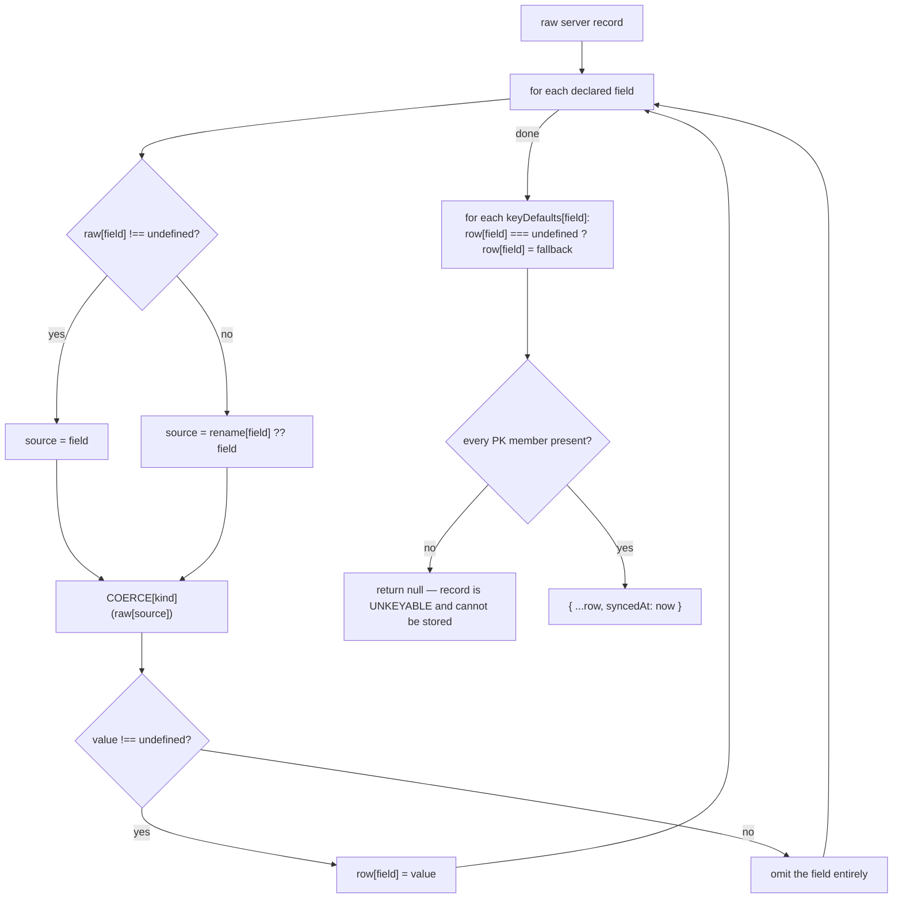

Coercion kinds: `text` is trimmed and an empty string is dropped; `count` and `date` are parsed to
numbers (dates to epoch millis); `structured` passes through as is. An empty array stays `[]`,
because screens read the stored row and a list field that vanished when empty would read as
`undefined.length`.

`entityKeyOf` treats `""` as a missing key member, **except** for a member whose declared
`keyDefaults` value is `""` itself.

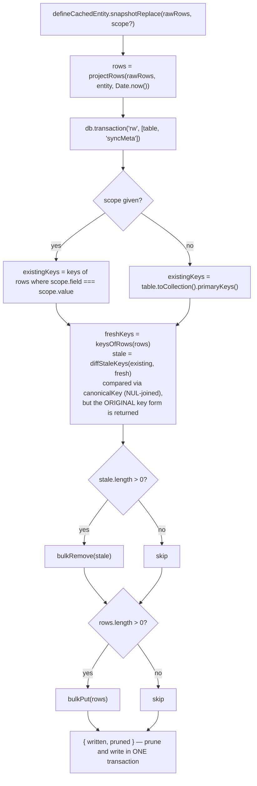

`canonicalKey` joins on NUL rather than `|` because `|` occurs in real OFBiz ids, which would make
`["A","B"]` and the single id `"A|B"` indistinguishable (`projection.ts`).

Source: `projection.ts`, `cachedEntity.ts`.

---

## F-MUT — Mutation write-through

```mermaid
sequenceDiagram
    autonumber
    participant V as View / composable
    participant API as Maarg (main thread, axios)
    participant SAS as setupAppDbSync
    participant SS as syncService
    participant H as Harness (worker)
    participant WAPI as Maarg (worker, fetch)
    participant DB as IndexedDB

    V->>API: POST/PUT the mutation
    API-->>V: 200 — the server change is COMMITTED
    V->>SAS: refreshAfterMutation(domain, pk)
    SAS->>SAS: whenReady() — await `starting`, or start now
    alt bootstrapState.errors.__start set
        SAS-->>V: throw CacheReconciliationError
    end
    alt no service
        SAS->>SAS: recordSyncError(domain, msg, cacheScopeKey(pk))
        SAS-->>V: throw CacheReconciliationError
    end
    SAS->>SS: service.refetchOne(domain, pk)
    SS->>H: Comlink refetchOne({ domain, pk })
    H->>H: scope = cacheScopeKey(pk) (sorted JSON-like form)
    H->>H: queue on refetchQueues[domain:scope]<br/>and runSharedDomainOperation(domain)
    alt domain has no refetchOne
        H-->>SS: postMessage sync-error { domain, scope, "domain has no refetchOne" }
        H-->>SAS: throw
    end
    H->>H: ctx.now = Date.now()
    Note over H: snapshot domains (defineSnapshotDomain.refetchOne) check in THIS order
    alt 1. fanOut and no byPk
        H->>WAPI: pageAll(urlFor(pk[parentKeyField]))  (no parent key → return 0)
        H->>DB: snapshotReplace(stamped, { parentKeyField, parentId })
    else 2. byPk
        H->>WAPI: GET byPk(pk).url — a failure REJECTS (no catch)
        H->>H: raw = byPkRecordKey ? resp[byPkRecordKey] : resp<br/>a one-item array is unwrapped to its item
        alt raw is an object
            H->>DB: upsertMany([raw])
        else nothing returned
            H->>DB: remove(entityKeyOf(pk)) — the record is gone server-side
        end
    else 3. refetchScope
        Note over H: scope value null/undefined → return 0, no request
        H->>WAPI: pageAll(listUrl, { ...listParams, ...scopeParams })
        H->>DB: snapshotReplace(rows, scope) — prunes that slice too
    else none of the three
        H->>H: return 0
    end
    Note over H,DB: fan-out and refetchScope paths return 0 without writing<br/>when every fetched row is unkeyable
    Note over H,WAPI: cursor domains (defineCursorDomain.refetchOne) instead page<br/>listUrl newest-first with { [first PK field]: id }, total 1, then upsert
    Note over H: the activation's args are passed through when the domain is active with args
    H-->>SS: postMessage refetch-end { domain, scope, written }
    SS->>SS: clearScopeError(domain, scope)
    DB-->>V: liveQuery emits the new row
    Note over H,SS: on failure classifyError yields auth-error (401/unauthorized) or sync-error
    Note over H,SS: both carry the scope (cacheScopeKey form), and the error is then rethrown
    Note over SAS: on rejection: recordSyncError(domain, msg, cacheScopeKey(pk))<br/>(same key the worker posted, so a no-op duplicate), then throw CacheReconciliationError
```

**Choosing `refetchScope` over `byPk`** — the strategy follows the endpoint and the row shape, as
`referenceDomains.ts` records per domain:

- `systemMessageRemote`: `GET oms/systemMessageRemotes/{id}` answers 405 for every id, so there is no
  by-PK route to call. The list route *does* filter by id, so re-listing that one id and
  snapshot-replacing its scope gives the same one-row refresh, and still prunes if the server no
  longer returns it.
- `inventoryEventDocument`: the stored row is (document, feed) while a mutation only knows the
  document. Re-listing that document and pruning its slice is what makes attach/detach correct — a
  plain upsert would leave behind the row for the feed the document just left.
- `serviceJob` uses `byPk` **with** `byPkRecordKey: "jobDetail"`, because the by-PK route wraps the
  job in a different envelope from the list route. Without the key the envelope itself is stored, its
  `jobName` is undefined, and the row is silently dropped.
- The common `enum` seed domain uses `refetchScope` by `enumId`. `admin/enums` filters on any
  Enumeration field, so re-listing one `enumId` refreshes it, and a deleted enum comes back empty and
  is pruned (`seedDomains.ts`). Before this, `refreshAfterMutation("enum", { enumId })` did nothing.

**Why the error type is distinct** (`reconciliation.ts`): the mutation *committed*.
`mutationCommitted = true` keeps that stage explicit so a retry cannot duplicate a create or replay
a date-effective association write.

---

## F-CONC — Worker concurrency queues

A poll tick and a post-mutation refetch can target the same domain at the same time. Three
structures order them.

```mermaid
flowchart TD
    subgraph legend["Ordering rules"]
      L1["sync (EXCLUSIVE): waits for the domain's prior exclusive<br/>AND every in-flight shared op"]
      L2["refetchOne (SHARED): waits only for the prior exclusive;<br/>siblings run concurrently"]
      L3["same-PK refetches serialize via refetchQueues[domain:scope]"]
    end
```

```mermaid
sequenceDiagram
    participant S1 as sync A (exclusive)
    participant R1 as refetch pk=A (shared)
    participant R2 as refetch pk=B (shared)
    participant R3 as refetch pk=A again
    participant S2 as sync B (exclusive)

    S1->>S1: runs
    R1-->>S1: awaits prior exclusive
    R2-->>S1: awaits prior exclusive
    S1->>S1: done
    par shared ops run together
        R1->>R1: runs
    and
        R2->>R2: runs
    end
    R3-->>R1: awaits refetchQueues["domain:pk=A"]
    R1->>R1: done
    R3->>R3: runs
    S2-->>R2: awaits ALL shared tails
    S2-->>R3: awaits ALL shared tails
    S2->>S2: runs
```

Queue tails are stored as `.then(ok, err) => undefined` so a rejection never poisons the chain, and
each entry deletes itself in `finally` only if it is still the current tail — so a slow op cannot
clear a newer one's queue.

Source: `pollingWorkerHarness.ts`.

---

## F-ACT — Per-view class-A activation (Company)

The activation API lives on `setupAppDbSync` and is re-exported by `src/services/appDbSync.ts`.
Views and composables import `activateSyncDomains`, `deactivateSyncDomains` and
`createSyncDomainOwner` from there (the former `useDbSync` composable has been deleted).

```mermaid
sequenceDiagram
    autonumber
    participant Vw as ShopifyProductSync.vue
    participant S as setupAppDbSync (services/appDbSync)
    participant SS as syncService()
    participant H as Harness (worker)

    Vw->>S: SYNC_OWNER = createSyncDomainOwner("shopifyProductSyncView")
    Note over Vw,S: once per screen INSTANCE, e.g. "shopifyProductSyncView:3"
    Vw->>Vw: productSyncPageDomains(jobNames) builds ActiveDomain[]
    Note over Vw: systemMessage per feature type,<br/>dataManagerLog per import config,<br/>syncRun spine, serviceJobRun scoped to displayed jobs,<br/>productUpdateHistory { shopIds: [id] }
    Vw->>S: onIonViewWillEnter: activateSyncDomains(domains, SYNC_OWNER)
    S->>S: generation = ++activationGeneration<br/>activeOwner = SYNC_OWNER, activeSyncDomains = domains
    S->>S: clearDomainErrors(each activated domain)
    alt no service yet (deep link before start, failed start, test double)
        S->>S: syncDomainsReady = true, return
        Note over S: the set stays in activeSyncDomains, the next startAppDbSync<br/>replays it into the new service (F-START)
    end
    S->>SS: setDomains(domains)
    SS->>SS: viewDomains = domains (held even while no worker exists)
    opt worker exists
        SS->>H: Comlink setDomains(domains)
        H->>H: viewDomains = domains, viewGeneration++
        H->>H: drop lastRunAt keys not in baseDomains ∪ viewDomains
        Note over H: baseDomains (the login class-B set) is untouched<br/>and keeps its once-per-login clock
    end
    S->>S: if generation still current: syncDomainsReady = true
    loop every baseTick
        H->>H: dueDomains(baseDomains ∪ viewDomains, lastRunAt, now, effectiveInterval)
        H->>H: run whichever are due, at each activation's own cadence
    end
    Vw->>S: onIonViewDidLeave: deactivateSyncDomains(SYNC_OWNER)
    alt activeOwner !== SYNC_OWNER, or activeSyncDomains already empty
        S-->>Vw: return — another screen holds the worker, or nothing to clear
    else still the holder
        S->>S: activeOwner = null, set = [], ready = false, activationGeneration++
        S->>SS: setDomains([])
        SS->>H: Comlink setDomains([])
        Note over H: viewDomains empties. baseDomains stays active,<br/>but its class-B entries already ran, so nothing is due
    end
    Note over H: rows already written stay, so a revisit paints instantly
```

A screen's manual refresh (`syncNow`) forces only `viewDomains`; see F-SNAP for the manual paths.

### Why the owner guard exists — Ionic transition order

Ionic fires `willLeave(A)`, then `willEnter(B)`, then `didEnter(B)`, then `didLeave(A)`. The
outgoing view's teardown runs **last**, after the incoming view has already activated its own
domains.

```mermaid
sequenceDiagram
    participant A as View A (owner "a:1")
    participant B as View B (owner "b:2")
    participant S as setupAppDbSync

    A->>S: activateSyncDomains(domainsA, "a:1")
    Note over S: activeOwner = "a:1"
    Note over A,B: navigate A to B
    B->>S: willEnter: activateSyncDomains(domainsB, "b:2")
    Note over S: activeOwner = "b:2", worker polls domainsB
    A->>S: didLeave: deactivateSyncDomains("a:1")
    S-->>A: ignored — "a:1" no longer holds the worker
    Note over S: domainsB keep polling
```

Without the guard, step 3 would call `setDomains([])` and B would poll nothing until some unrelated
watcher re-activated it.

- **Keyed on the owner, not the set.** A screen's set changes while it is open
  (`ShopifyProductSync` re-activates as job names resolve), so comparing sets would reject that
  screen's own teardown and leave its polling running.
- **Owners are per instance.** Three routes share the `ShopifyInventorySync` component and navigate
  between each other, and two order-sync sessions share one feature id. A shared owner string would
  match the departing instance and wipe the arriving one's domains.
- **The generation counter** covers the RPC gap. `setDomains` is asynchronous, so an activation
  whose RPC resolves after a newer activation or an accepted deactivation must not flip
  `syncDomainsReady` back on.
- `deactivateSyncDomains()` with **no owner** keeps the unconditional clear, for a hard reset or a
  test.

Activation has three kinds of trigger at the call sites, and all three go through
`activateSyncDomains`: view enter, a `watch` on the scope key (`productStoreId`, `shopId`), and
imperative re-activation after a mutation or a data load.

`ActiveDomain` is `{ name, intervalMs?, args? }` (`syncRegistry.ts`). `intervalMs` overrides the
domain's declared cadence; `args` are handed to `sync(ctx, args)` and participate in `activationKey`.

**One screen set.** There is one `viewDomains` set beside the start set. Two features that must poll on one screen compose one domain list and activate
it once. `useShopify` does this for its sync sessions, which keeps each feature's `intervalMs`
cadence on one activation. Two separate activations would overwrite each other.

Order Manager has **no** activation call sites. The harness start set (every registered class-B
domain) is its entire policy, and `viewDomains` stays empty.

---

## F-READ — Read paths

```mermaid
flowchart TD
    subgraph a["useDb(table, options) — reactive list"]
      A1["resolve db: getAppDb().raw() or the passed BaseDB"]
      A1 --> A2["resolvedOptions = computed(options)"]
      A2 --> A3["watch(resolvedOptions, immediate, deep)"]
      A3 --> A4["unsubscribe previous, then<br/>dbClient(db).entity(table).live(opts).subscribe()"]
      A4 --> A5["next: records = rows; emitted = true; error = null"]
      A4 --> A6["error: log, set error, emitted = true"]
      A5 --> A7["hydrated = emitted && (records.length > 0 || !serviceState.running)"]
      A3 --> A8["onUnmounted: unsubscribe"]
    end

    subgraph b["useSeedData() / seedData — shared live seed tables"]
      B1["getter needs a table: seedTable(table)"]
      B1 --> B2{"entry for dbName/table<br/>in the module map?"}
      B2 -- "no (first use)" --> B3["rows = shallowRef([]), synced = shallowRef(false)<br/>liveQuery(async () => await readSeedTable(table)).subscribe()<br/>store entry { rows, synced, loaded, subscription }"]
      B2 -- yes --> B4["reuse it: no new read"]
      B3 --> RS["readSeedTable: ensureDbReady, then ONE 'r' transaction over<br/>[table, syncMeta]: table.toArray() +<br/>syncMeta.get('loginSync:' + domain) (no seed domain → synced)"]
      RS --> B5["next: rows.value = rows; synced.value = marker.synced;<br/>loaded settles. Re-emits on a write to the table or to<br/>that one marker: login sync, refreshAfterMutation, resync"]
      B3 --> B6["error: warn, drop the entry<br/>(the next use opens a fresh one)"]
      B4 --> B7["reactive getter: reads rows.value<br/>(tracked by the calling template / computed)<br/>raw id or [] until the first emission"]
      B5 --> B7
      B7 --> WS["list getter .withSync(...args) → { data, synced }<br/>synced = every table the getter reads has synced this login,<br/>so an empty data is real rather than 'not landed yet'"]
      B4 --> B8["async get*: await loaded,<br/>then return the current rows.value"]
      B5 --> B8
      B7 --> B9["labels: first non-empty of description, enumName,<br/>name, groupName, facilityName, storeName — else the raw id<br/>joins in memory: statesForCountry (GAT_REGIONS), enumsByParentType, ..."]
    end

    subgraph c["useDbStatus(db, catalogSource, actions) — status card"]
      C1{"catalogSource is an array?"}
      C1 -- yes --> C2["resolvedCatalog = it; catalogLoaded = true"]
      C1 -- no --> C3["await it (worker catalog over Comlink)"]
      C3 --> C4["on success: items.length ? items : DEFAULT_COMMON_SYNC_CATALOG"]
      C3 --> C5["on failure: DEFAULT_COMMON_SYNC_CATALOG (worker may not be up yet)"]
      C2 --> C6["liveQuery(computeRows).subscribe()"]
      C4 --> C6
      C5 --> C6
      C6 --> C7["computeRows: ensureDbReady; read syncMeta;<br/>parse 'domain:' then 'loginSync:' markers;<br/>count() each catalog table"]
      C7 --> C8["status = count > 0 ? success<br/>: (syncedAt || syncClass === 'A') ? empty : none"]
      C6 --> C9["BroadcastChannel(DB_SYNC_CHANNEL).onmessage -> recompute"]
      C6 --> C10["watch(resolvedCatalog): re-subscribe when it goes empty -> populated"]
      C8 --> C11["refreshDomain -> actions.resyncDomain; refreshAll -> actions.resyncAll"]
    end
```

The two live reads differ in lifetime. A `useDb` subscription belongs to the component that opened
it and closes on unmount. A `useSeedData` table is opened by whichever caller needs it first, is
shared by every later caller, and stays open until logout or the login-time clear (`clearSeedTables`
in F-TEAR). That is at most one subscription per seed table. It re-runs only when that table or its
own domain's `loginSync:` marker is written, because `get` on one key keeps the other domains'
markers out of its read set (`useSeedData.ts`).

The seed querier must itself be `async` (`async () => await readSeedTable(table)`). Dexie carries
its read tracking across the awaits inside `readSeedTable` only for an async querier. A plain arrow
that returns the promise records no tables, so the query would never re-run.

`seedData` is a plain module-level object, the result of one `useSeedData()` call. Stores import it
so they can read seed data without calling a composable.

`useDb` reads through `dbClient`'s query rules:

- `scope` and `equals` are one set of equalities, and every one holds on the result. They resolve
  through the widest declared index that covers them, and the rest are applied in memory.
- `dateField` orders the result, newest first unless `order: "asc"`, and `since`/`until` bound it.
- Without `dateField`, rows come back in storage order (`dbClient.ts`, `types.ts`).

Catalog source per app:

| App | Source | Line |
|---|---|---|
| Company | `async () => (await syncService()?.catalog()) ?? []` — the worker registry | `views/Settings.vue` |
| Order Manager | `orderManagerDb.statusCatalog` — derived at `defineAppDb` time | `views/Settings.vue` |

Actions are **injected, not imported**, because a status card must refresh through the same
main-thread service that owns its worker (`useDbStatus.ts`).

---

## F-ERR — Error and status propagation

```mermaid
flowchart TD
    W["worker postMessage"] --> HM["syncService.handleMessage(generation, event)"]
    HM --> GEN{"generation === startGeneration?"}
    GEN -- no --> DROP["DROP — a terminated attempt's last queued message"]
    GEN -- yes --> TY{"data.type"}

    TY -- auth-error --> AE["pushTokenIfChanged() immediately<br/>recordSyncError(domain, message, scope?)<br/>then opts.onAuthError(message)"]
    TY -- sync-end --> SE["serviceState.written[domain] = written<br/>serviceState.syncedAt[domain] = at<br/>lastSyncAt = now<br/>clearDomainErrors(domain)"]
    TY -- refetch-end --> RW["serviceState.written[domain] = written<br/>serviceState.syncedAt[domain] = at ?? now"]
    RW --> RE{"scope present?"}
    RE -- yes --> RE1["clearScopeError(domain, scope)"]
    RE -- no --> RE2["clear nothing — a scopeless message<br/>cannot prove another scope recovered"]
    TY -- sync-error --> ER["recordSyncError(domain, message, scope?)"]
    TY -- "sync-start, sync-cycle-start,<br/>sync-cycle-end" --> PASS["no bookkeeping in the service"]

    AE --> FWD
    SE --> FWD
    RE1 --> FWD
    RE2 --> FWD
    PASS --> FWD
    ER --> FWD["opts.onStatus(data) -> setupAppDbSync's listener<br/>repeats the same bookkeeping (idempotent),<br/>so a test double's statuses are still recorded;<br/>it files an error with no domain under '__start'"]
    FWD --> SDE["syncDomainsError = last error among the<br/>ACTIVATED domains, in activation order"]
```

```mermaid
flowchart LR
    subgraph vis["updateVisibleError(domain)"]
      D{"domainErrors.has(domain)?"}
      D -- yes --> V1["errors[domain] = the domain-level message"]
      D -- no --> S{"scopedDomainErrors[domain] non-empty?"}
      S -- yes --> V2["errors[domain] = the NEWEST scoped message"]
      S -- no --> V3["delete errors[domain]"]
    end
```

- A **full snapshot** verifies the whole domain, so `sync-end` clears the domain *and* every scope
  behind it.
- A **targeted refetch** verifies only its own PK scope.
- `bootstrapState.errors` and `serviceState.errors` are the same object, so the app facade and the
  service always agree on what is visible.
- A screen reads `syncDomainsError`, not `serviceState.errors` directly. It is scoped to the
  screen's activated set, so a background domain's failure cannot light that screen's banner, and
  `activateSyncDomains` clears those domains' errors first so a newly opened screen starts clean.
- A repeated scoped failure is re-inserted at the end of the map so the visible message reflects the
  newest failure. `recordSyncError` skips re-insertion when the same scope already holds the same
  message. That skip absorbs the duplicate that `refreshAfterMutation`'s `catch` records after the
  worker has already posted the failure: both key the scope with `cacheScopeKey(pk)`
  (`reconciliation.ts`), e.g. `{"enumId":"X"}`, so one failed refetch leaves one entry, and a later
  successful `refetch-end` for the same record clears it.

Source: `syncService.ts`, `setupAppDbSync.ts`.

---

## F-TOK — Token freshness

```mermaid
sequenceDiagram
    participant CU as commonUtil (main)
    participant SS as syncService (main)
    participant BC as BroadcastChannel<br/>"accxui:polling-auth-token"
    participant H as Harness (worker)

    Note over SS: at start()
    SS->>CU: getToken()
    SS->>H: api.start({ token, ... })  // initial value only
    loop every tokenWatchMs (15s)
        SS->>CU: getToken()
        alt changed and non-empty
            SS->>BC: publish({ token })
            BC->>H: onmessage
            H->>H: ctx = { ...ctx, token: next }
        end
    end
    Note over H: a tick with no token returns immediately (tick guard)
    H-->>SS: auth-error
    SS->>CU: getToken()
    SS->>BC: publish immediately (the token may have just rotated)
```

The worker is a separate realm and cannot call `commonUtil.getToken()`. Snapshotting the token once
at `start()` would go stale on rotation, so the token is **held and pushed**, never frozen
(`channels.ts`). `subscribeToken` is called inside `createSyncHarness`, not at module
scope, so each harness instance owns its own subscription (`pollingWorkerHarness.ts`).

---

## F-TEAR — Logout, instance switch, teardown

`stopAppDbSync()` is the one teardown. It runs at logout (`postLogout`) **and** at the start of every
login (`postLogin`, F-START), so a session that ended without a logout cannot leak into the next one.

```mermaid
flowchart TD
    subgraph lo["stopAppDbSync — user.ts postLogout, and postLogin before anything else"]
      L1["setupAppDbSync: startGeneration++, starting = null<br/>— invalidate any in-flight start"] --> L3["service.stop(); service = null"]
      L3 --> L2["service: startGeneration++ (late worker messages dropped), starting = null"]
      L2 --> L4["clearInterval(tokenWatch)"]
      L4 --> L5["publisher.close()"]
      L5 --> L6["terminate() — kills the worker AND its timer"]
      L6 --> L6b["harness = null; held viewDomains = null"]
      L6b --> L7["serviceState.running = false"]
      L7 --> L8["clearSeedTables()<br/>unsubscribe every useSeedData live table, empty the map"]
      L8 --> L9["clearDatabaseTables(db.raw())<br/>one rw txn over every table: clear() each data table;<br/>in syncMeta delete every key EXCEPT 'schemaVersion'<br/>errors are logged, never block logout"]
    end

    subgraph sw["OMS instance switch"]
      S1["resolver now returns a different instance"]
      S1 --> S2["next raw()/get() computes a new dbName"]
      S2 --> S3["activeDb.close() — a liveQuery holding it stops serving the old tenant"]
      S3 --> S4["new AppDatabase(newName) — a DIFFERENT IndexedDB database"]
      S4 --> S5["late-binding clients follow automatically;<br/>a captured handle would now throw DatabaseClosedError"]
    end

    subgraph vs["View exit (class A)"]
      V0["onIonViewDidLeave -> deactivateSyncDomains(owner)"]
      V0 --> VQ{"owner still holds the worker<br/>and the set is non-empty?"}
      VQ -- no --> VN["no-op — the next screen already activated (F-ACT)"]
      VQ -- yes --> V1["setDomains([]); syncDomainsReady = false"]
      V1 --> V2["harness viewDomains empties; baseDomains stays,<br/>timer still ticks, nothing is due"]
      V2 --> V3["rows stay — a revisit paints instantly from the DB"]
    end
```

**Why `schemaVersion` survives the clear.** The main thread has already verified the version in its
realm, so after a logout and login in the same tab it writes straight to the emptied database. The
sync worker that the login starts is a separate realm. If the marker were gone, the worker would take
the database for an unrecorded build, delete and rebuild it, and drop what the main thread had just
written. In fulfillment that was the facility master list, so the Open page stayed empty until a
reload (`baseDb.ts`).

Teardown deliberately leaves two things in place:

- **The error maps** behind `serviceState.errors`. Stale entries are cleared per domain, by the next
  successful `sync-end` or by `activateSyncDomains`.
- **The main-thread screen set.** `stopAppDbSync` resets neither `activeSyncDomains` nor
  `activeOwner`. A screen that never deactivated before the stop has its set replayed into the next
  service by `startAppDbSync` (F-START).

Also available: `deleteLegacyCaches()` (`baseDb.ts`) drops the superseded fixed-name databases
`DataManagerLogCacheDB` and `CompanyCacheDB`. Company's `startAppDbSync` wrapper calls it once per
page load (`apps/company/src/services/appDbSync.ts`).

---

## F-APPS — Company vs Order Manager wiring

```mermaid
graph TB
    subgraph co["Company"]
      CSCHEMA["companySchema.ts — 48 entities"]
      CPICK["commonSchema.pick(17)"]
      CDB["companyDb = defineAppDb('CompanyDB', v4)"]
      CSCHEMA --> CDB
      CPICK --> CDB
      CW["appSync.worker.ts"]
      CSEED["12 commonDomains — those whose table is in<br/>companyDb.seedTables, minus the 5 overridden tables"]
      CHAND["22 hand-written domains (19 class A, 3 class B)"]
      CREF["26 referenceDomains — Company-specific class-B domains and seed overrides"]
      CSEED --> CW
      CHAND --> CW
      CREF --> CW
      CDB --> CW
      CW --> CRES["worker re-registers setOmsInstanceResolver<br/>(hand-written domains resolve via raw())"]
      CSVC["services/appDbSync.ts"]
      CDB --> CSVC
      CSVC --> CVIEW["activateSyncDomains(ActiveDomain[], owner) per view<br/>deactivateSyncDomains(owner) on didLeave"]
      CSVC --> CSET["Settings.vue -> useDbStatus(async worker catalog)"]
      CSVC --> CMUT["~80 refreshAfterMutation call sites"]
    end

    subgraph om["Order Manager"]
      OSCH["commonSchema — all 29, no own tables"]
      ODB["orderManagerDb = defineAppDb('OrderManagerDB', v2)"]
      OSCH --> ODB
      OW["appSync.worker.ts"]
      OSEED["registerDomains(Object.values(commonDomains)) — all 29<br/>(also on the main thread, in main.ts)"]
      OSEED --> OW
      ODB --> OW
      OSVC["services/appDbSync.ts"]
      ODB --> OSVC
      OSVC --> ODEF["no activation — the harness start set<br/>(every registered class-B domain) is the whole policy"]
      OSVC --> OSET["Settings.vue -> useDbStatus(static statusCatalog)"]
      ODB --> OREAD["useSeedData() / seedData in ~35 files"]
    end
```

Company's worker does not hand-list its seed domains. It derives them from the composed schema: a
common domain is registered only when its table is in `companyDb.seedTables`, which holds the 17
picked tables. That leaves out the 12 common domains whose tables Company never picked; a hand list
once registered them and each failed on every login sync. It also leaves out the five overridden
tables (`OVERRIDDEN_SEED_TABLES`: `carriers`, `carrierShipmentMethods`, `shopifyShops`,
`facilityGroups`, `statuses`), which gives 17 − 5 = 12 common domains.

The five overridden domains (`carrier`, `carrierShipmentMethod`, `shopifyShop`, `facilityGroup`,
`status`) are re-declared in `referenceDomains.ts` with app-specific `listParams`, `strictCollection`,
`refetchScope` or `byPk`, while the *tables* still come from `commonSchema.pick(...)`. The `seedTables`
provenance set is what keeps the two facts from contradicting each other (`appSync.worker.ts`,
`referenceDomains.ts`).

---

## Legend

| Symbol | Meaning |
|---|---|
| `THROW` | Fails loudly. For `defineEntity` / `defineSchema` this is at module evaluation. |
| `GUARD` | A deliberate refusal to write, protecting existing rows. |
| Dashed arrow | `BroadcastChannel` or `postMessage` (cross-realm, fire-and-forget). |
| Solid arrow in a sequence | direct call, or Comlink RPC across the worker boundary. |
