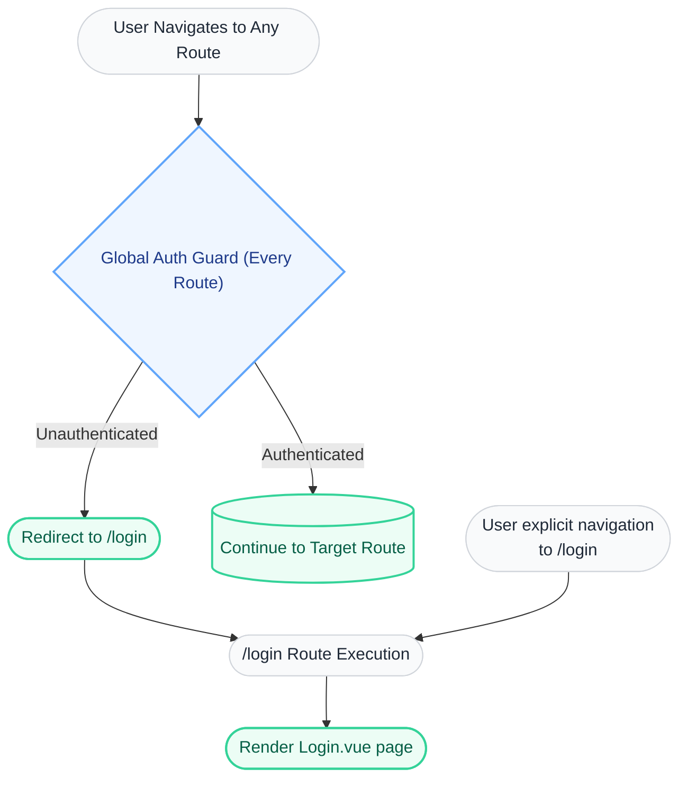
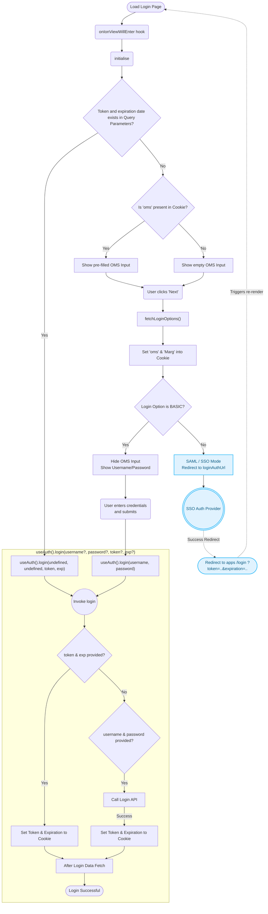

# Authentication & Login Flow Design Document

---

## 1. Overview
### 1.1 Objective
**Core goal:** A user proves who they are once, and that fact stays true — across page reloads, across a redirect to an external login page and back, and across the different apps in this product — without asking for a password more than once per session.

What it must achieve:

1. **Verify identity.** Accept a username/password (or a token handed back from an SSO identity provider) and confirm it's valid against the server.
2. **Survive the page being gone.** A full page reload, or a full navigation away to an SSO provider and back, must not lose the fact that the user logged in. (This is why the "logged in" fact can't live only in memory — it has to be something that outlives the page.)
3. **One login, many apps.** The product is split into several apps (company, transfers, bopis, and others). Logging into one must be enough — opening another app should not ask for a password again, as long as the original session is still valid.
4. **Each app still needs its own picture of the user.** Being logged in is one fact, shared everywhere. What the user is allowed to do and who they are (profile, permissions) is specific to each app, and each app must establish that for itself once it knows the login is valid.
5. **A single, trustworthy answer to "am I logged in, right now, for this app?"** Every page in every app must be able to ask this and get one correct answer, so it can decide whether to show the page or send the user back to log in.
6. **Logging out must end the session everywhere it matters.** Once logged out, no app should be able to silently treat the user as still logged in.

### 1.2 Problem Statement
To present a unified view of the login and authentication flow, outlining how a user progresses from initial navigation to a fully authenticated state through either direct credential-based login or SAML-based Single Sign-On (SSO).

### 1.3 Success Criteria
1. **Verify identity** — A login with correct credentials returns a valid token. A login with incorrect credentials is rejected, shows a clear error, and sets no token or session cookie.
2. **Survive the page being gone** — After a full page reload, or after completing an SSO redirect round-trip, a still-valid session stays logged in with no re-prompt for credentials.
3. **One login, many apps** — After logging into one app, opening any other app in the suite (same browser) with a still-valid token does not prompt for credentials again.
4. **Each app builds its own picture of the user** — Each app fetches its own profile and permissions after confirming the session is valid, independent of what any other app has already fetched.
5. **One trustworthy answer to "am I logged in"** — `isAuthenticated` is true whenever a valid, unexpired token exists, and false otherwise — never anything in between. A failed login attempt, followed by a successful retry with corrected credentials, must result in a fully logged-in session with no lingering effect from the earlier failure.
6. **Logout ends the session everywhere it matters** — After logout, the token is cleared, and the next page load in this or any other app in the suite is treated as unauthenticated.

## 2. Scope
### 2.1 In Scope
- Vue Router global navigation guards (`authGuard`).
- `Login.vue` lifecycle hooks (`onIonViewWillEnter`, `initialise`).
- Multi-tenant IDP rule checks (`fetchLoginOptions`).
- Processing logic within the central `useAuth().login` capability.

**Authentication paths covered:**

Paths that require the user to do something:
1. **Basic login** — no OMS remembered (or user picks "change OMS"); user enters the OMS URL, the server reports `BASIC` auth, and the user submits username/password.
2. **SSO/SAML login (start)** — same OMS-picking step, but the server reports a non-`BASIC` auth type; the browser navigates away to the identity provider.
3. **Local dev server auto-login** *(dev-only)* — user picks a locally-discovered dev OMS; if `VITE_USERNAME`/`VITE_PASSWORD` are set, credentials are filled in and submitted automatically.

Paths that happen automatically, without user action, on page load:

4. **Legacy launchpad redirect** — the URL arrives with both `?token=` and `?oms=` from an older, separate launchpad app; existing auth is cleared and login runs immediately with that token.
5. **SSO/SAML return** — the URL arrives with just `?token=`, the identity provider's redirect back from path 2; login runs immediately with that token.
6. **Already fully logged in** — this app's own local session copy already agrees with the cookie and the token isn't expired; skips straight into the app with no server call.
7. **Silent re-login from an existing session** — not fully warm per path 6, but a valid-looking session still exists in cookies (e.g. another app in the suite already logged in); logs in quietly using that token, no password asked.

### 2.2 Out of Scope
- Backend/Server implementation of SAML exchanges.
- Details of the post-login store hydration beyond the initial API fetch trigger.
- User registration and password reset workflows.
- Shopify-embedded app login (`ShopifyLogin.vue`) — a separate mechanism, not covered here.

## 3. Background / Context
The AccxUI applications serve multiple deployment topologies and organizations (OMS profiles), necessitating a dynamic login form that queries identity provider specifics dynamically before presenting credential inputs. Furthermore, strict routing guarantees ensure that access boundaries are respected universally, blocking unauthorized route navigation prior to rendering any protected UI framework components.

## 4. Proposed Solution
### 4.1 High-Level Design
The security architecture encompasses two logical boundaries:
1. **Global Auth Guard**: Intercepts every route dispatch. If unauthenticated, automatically bounces the request to `/login`.
2. **Login View & Composable**: Once routed to `/login`, `Login.vue` identifies the tenant from cookies or input, fetches the application mode (BASIC vs SAML), executes credential submission, manages SSO URL parameters, captures JWT tokens, and hands everything off to the unified `useAuth` composable state function.

### 4.2 UI Mockup
*N/A - Design logic focuses heavily on routing and application state transition rather than static visual renderings.*

### 4.3 Diagrams

#### 4.3.1 Routing & Navigation Guard Topology
This diagram demonstrates how the `authGuard` placed on every route manages the execution and redirection to the `/login` route.



#### 4.3.2 Login.vue Conditional Execution & State Matrix
Visualizes what transpires specifically within the `Login.vue` file. Accounts for the four distinct logic branches based on Cookie status vs Authentication type (BASIC vs SAML).



### 4.4 Data State & Storage Strategy
#### 4.4.1 Pinia State Structure
The user identity values, active facility entitlements, and user-level component configurations are not loaded pre-auth; they are strictly loaded post-login during the `after login data fetch` action inside internal stores like `user` or `store`.

#### 4.4.2 Document/Cookie Storage Strategy
- `oms`: Stored as a browser cookie. It persists across browsing sessions to accelerate the login pipeline by pre-filling the environment identifier.
- `Marg`: Accompanying tracking parameter retrieved seamlessly alongside the network configuration rules.
- Core Identity: Authenticated state entirely depends on validation cookies encapsulating bearer token durations/dates.

#### 4.4.3 Data Flow & Sync
- Navigation (Guest) → Redirect via Route Guards → `Login.vue` loads parameters/cookies.
- UI Captures OMS → Network fetch for tenant profile → Branching strategy dynamically updates component state (`BASIC` vs `SAML`).
- `useAuth()` unifies backend validation checks and applies the resulting token boundaries to the frontend environment.

### 4.5 Pseudocode / Logic Flow
**Global Router Abstraction:**
```javascript
// Global authGuard (applied to protected routes)
const authGuard = async (to: any, from: any, next: any) => {
  const { isAuthenticated } = useAuth()
  if (!isAuthenticated.value) {
    next('/login');
  } else {
    next()
  }
};
```

**Login Component Initialization Sequence:**
```javascript
// useAuth.ts Composable API design
const login = async (username?: string, password?: string, token?: string, expirationDate?: string) => {
  if (token && expirationDate) {
    // SAML/SSO logic
    cookieHelper().set('token', token);
    cookieHelper().set('expirationTime', expirationDate);
  } else if (username && password) {
    // BASIC authentication logic via API
    const resp = await apiCall({ username, password });
    cookieHelper().set('token', resp.token);
    cookieHelper().set('expirationTime', resp.expirationTime);
  }
  // after login data fetch
};

// executed via onIonViewWillEnter on Login.vue
async function initialise() {
  if (route.query.token && route.query.expirationDate) {
    // Escaped out of standard inputs; user arriving with active external assertions.
    await useAuth().login(undefined, undefined, route.query.token, route.query.expirationDate);
  } else {
    // Interactive Boot Protocol
    oms.value = readCookie('oms');
    showOmsInput.value = true;
  }
}
```

### 4.6 Alternatives Considered

## 5. Security & Permissions

## 6. Verification Plan

## 7. Rollout Plan

## 8. Risks & Mitigation

## 9. References
