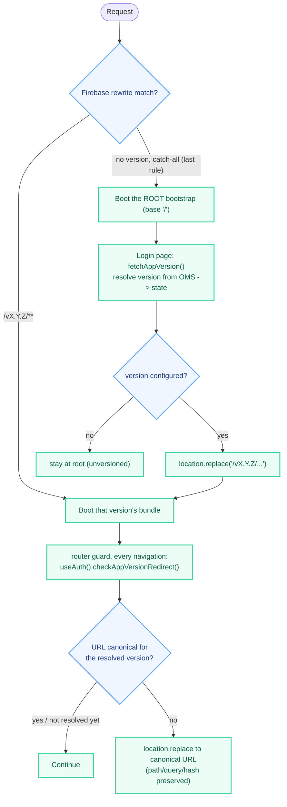

# Multi-Version App Hosting Design Document

## 1. Overview
### 1.1 Objective
Allow an AccxUI app to have **multiple built versions live on Firebase Hosting at once**, with the
version a tenant is served baked into the URL path (e.g. `https://bopis-dev.hotwax.io/v5.0.0/tabs/orders`),
and with the version to serve **decided by the OMS**, not the browser or a manual link.

The app ships as two kinds of build behind one Firebase site:
- a **root bootstrap** (Vite `base: '/'`, output at `dist/index.html`) served by the catch-all rewrite, and
- one **immutable per-version build** per retained version (Vite `base: '/vX.Y.Z/'`, output at `dist/vX.Y.Z/`).

An unversioned request loads the bootstrap, which authenticates, asks the OMS which version this
deployment should run, and redirects onto that version's own URL.

### 1.2 Problem Statement
A plain `firebase deploy` replaces the entire site with a single `dist/` build. One live version per
environment means there is no way to keep an older version reachable for a tenant not ready to move, no
way to tell from a URL which build a page came from, and no way for the OMS to decide which build a
tenant should be on.

### 1.3 Success Criteria
- The version is determined by the OMS (`appVersions` endpoint, §4.2) — the frontend never hardcodes it.
- The version is visible in the URL, so a screenshot/bug report/support link is unambiguous.
- N versions live simultaneously on one site; one deploy never wipes out another (§4.5).
- There is one canonical URL for a tenant: the versioned one (`/vX.Y.Z/...`) if the OMS has a version
  configured, the unversioned one (`/...`) if it doesn't. A stale/incorrect version prefix — old
  bookmark, manual edit, mid-session re-pin — is redirected to that canonical URL, preserving the rest
  of the path, the query string, and the hash (§4.3).
- An unversioned URL always resolves: it loads the root bootstrap, which resolves the version and
  redirects if one is configured.

## 2. Scope
### 2.1 In Scope
- URL structure and Firebase Hosting rewrite strategy for serving many versions from one site.
- Build-time changes (Vite `base`/`outDir` driven by `VITE_APP_VERSION_CONFIG.buildVersion`) that make a
  build self-contained under a version prefix.
- Resolving the version from the OMS on the Login page and canonicalizing the URL.
- The client-side canonicalization + redirect logic and where it runs.
- A manual build/deploy flow that *adds* a version instead of replacing the site (an automated,
  additive pipeline is deferred — §4.5).

### 2.2 Out of Scope
- The admin UI/workflow for setting the OMS's `CommerceAppDeployment.currentVersion` (§4.2). This is
  provided by the **company** app, which has the UI for managing app versions; it is out of scope for
  this document (which covers only how a served app resolves and honors that configured version).
- Native mobile (Capacitor) versioning.
- Percentage-based canary/blue-green splitting (version selection is deterministic per tenant).

## 3. Background / Context
- **All multi-version config lives in one env var**, `VITE_APP_VERSION_CONFIG`, a JSON string of
  `{ appId, environmentTypeId, buildVersion }`. It's assumed to always be a valid object and is
  `JSON.parse`d inline at each use site: `vite.config` reads `buildVersion` at build time (via `loadEnv`),
  and `useAuth.fetchAppVersion` reads `appId`/`environmentTypeId` at runtime (via `import.meta.env`).
- **Vite** `base`/`outDir` are driven by `buildVersion` ([`apps/bopis/vite.config.ts`](../apps/bopis/vite.config.ts)):
  `const appBuild = JSON.parse(env.VITE_APP_VERSION_CONFIG).buildVersion`,
  `base: appBuild ? '/${appBuild}/' : '/'`, `outDir: appBuild ? 'dist/${appBuild}' : 'dist'`. So an empty
  `buildVersion` produces the root bootstrap at `dist/`, and `buildVersion: "v5.0.0"` produces `dist/v5.0.0/`.
- **Router** uses `createWebHistory(import.meta.env.BASE_URL)` ([`apps/bopis/src/router/index.ts`](../apps/bopis/src/router/index.ts)).
  A build-time constant is fine here **because each bundle is only ever served from the path matching its
  own `base`** — the root bootstrap (`base '/'`) serves unversioned URLs via the catch-all, and each
  versioned bundle (`base '/vX.Y.Z/'`) serves only its own subtree via its per-version rewrite. This is
  why the runtime-base fix the original proposal required is unnecessary in the shipped model.
- **`appVersion` lives in the app's `user` Pinia store** ([`apps/bopis/src/store/user.ts`](../apps/bopis/src/store/user.ts)),
  which is `persist: true` (localStorage, origin-scoped). It is surfaced to shared `common/` code through
  an `accxuiConfig` getter/setter — the same pattern as `oms`/`current` ([`apps/bopis/src/main.ts`](../apps/bopis/src/main.ts),
  [`common/core/configRegistry.ts`](../common/core/configRegistry.ts)). There is **no** dedicated
  version store.
- **Auth cookies** (`token`, `oms`, `expirationTime`, `userId`, `maarg`, via [`cookieHelper.ts`](../common/helpers/cookieHelper.ts))
  are `path=/`, `domain=hotwax.io` — domain-wide, so session state carries across version paths.
- **Service worker**: `vite-plugin-pwa` with `registerType: 'autoUpdate'` and `selfDestroying: true`
  (self-unregistering shim; no active per-version SW scope today).
- **Client-side storage is origin-scoped**, so the root bootstrap and every version bundle share the
  same cookies and `localStorage` — which is exactly how the persisted `appVersion` survives the
  bootstrap → versioned-bundle redirect.

**Key Firebase constraint**: a `rewrite`'s `destination` must be a static path — there is no
`/:version/** → /:version/index.html` that resolves `:version` dynamically for static files. So N
versions means N explicit rewrite entries, generated at deploy time (§4.5).

## 4. Proposed Solution (as implemented)
### 4.1 Core Model — root bootstrap + immutable per-version builds
Every deployed version is a complete, self-contained, immutable bundle at `/vX.Y.Z/` (own `index.html`,
assets, SW, manifest — Vite `base: '/vX.Y.Z/'`). Separately, a **root bootstrap** (Vite `base: '/'`) is
deployed at `dist/index.html` and served by Firebase's catch-all rewrite for any unversioned request.

**Resolution flow:**
1. A versioned request (`/v5.0.0/...`) is served directly by that version's per-version rewrite (§4.4).
2. An unversioned request (`/...`, e.g. a fresh visit or `/login`) hits the catch-all → the **root
   bootstrap** loads.
3. On the Login page the bootstrap runs `fetchAppVersion()` (§4.2), which resolves the version from the
   OMS, writes it to state, and — via `checkAppVersionRedirect()` (§4.3) — `window.location.replace`s
   onto the versioned URL if a version is configured. The versioned bundle then boots and serves the
   rest of the session.
4. On every subsequent navigation the router guard re-runs `checkAppVersionRedirect()` using the
   persisted value (no network), so a manually removed/altered/invalid version prefix is corrected.



### 4.2 Version Source — the `appVersions` endpoint
The version is resolved by a dedicated OMS endpoint, **not** by a `checkLoginOptions` contract change
(that was the original proposal). [`useAuth.ts#fetchAppVersion`](../common/composables/useAuth.ts):
```jsonc
// GET admin/apps/{appId}/appVersions?appId={appId}&environmentTypeId=AppEnvUAT
[ { "currentVersion": "v5.0.0", ... } ]   // configured; take [0].currentVersion
[]                                        // no version configured for this environment
```
- `appId` (both the URL path segment and a query param) and `environmentTypeId` come from
  `JSON.parse(import.meta.env.VITE_APP_VERSION_CONFIG)` — i.e. the single config object, not a hardcoded
  value.
- The response is treated as an array (or `resp.data.docs`); `appVersions?.[0]?.currentVersion` is the
  configured version. An empty list `[]` (a normal success, `hasError` false) means **no version
  configured**.
- The endpoint is on the request interceptor's no-auth allowlist (`"appVersions"` in
  [`remoteApi.ts`](../common/core/remoteApi.ts)), so it can run pre-authentication on the Login page.

### 4.3 Resolution, State, and Canonicalization
**Three states of `appVersion`** (`string | undefined`), and the distinction is load-bearing:
- `undefined` — **not resolved yet** (initial load, or just reset). Enforcement is a **no-op** — acting
  before the OMS has answered would bounce a versioned URL to root, re-pin, and bounce back forever.
- `""` — **resolved: no version configured.** A versioned URL is stale → strip to root.
- `"vX.Y.Z"` — **resolved: pinned.** The URL must always carry exactly that version.

**Pure canonicalization** ([`common/utils/appVersionUtil.ts`](../common/utils/appVersionUtil.ts)) — no
store/router/`window` dependency, unit-testable:
- `getVersionedPathInfo(pathname)` → `{ version, rest }` (version = the leading `vX.Y.Z` segment or `null`).
- `getCanonicalPath(configuredVersion, pathname)` → the path the app should be on, or `null` if already
  canonical. `""` means "no version."

**Behavior matrix** — every combination of resolved state and current URL:

| `appVersion` | Current URL | Action |
|---|---|---|
| `undefined` (not resolved yet) | anything | **no-op** — wait for `fetchAppVersion` on the Login page (acting now could bounce/loop) |
| `""` (no version configured) | unversioned (`/tabs/orders`) | already canonical — stay at root |
| `""` (no version configured) | versioned (`/v5.0.0/tabs/orders`, manually appended) | **strip** → redirect to `/tabs/orders` |
| `v5.0.0` (pinned) | `/v5.0.0/tabs/orders` | already canonical — stay |
| `v5.0.0` (pinned) | unversioned (`/tabs/orders`, prefix removed) | **add** → redirect to `/v5.0.0/tabs/orders` |
| `v5.0.0` (pinned) | `/v5.0.1/tabs/orders` (mismatch) or `/v9.9.9/tabs/orders` (invalid) | **switch** → redirect to `/v5.0.0/tabs/orders` |

Every redirect preserves the rest of the path, the query string, and the hash. See §8 for the one case
this can't catch: an unresolved (`undefined`) session on a manually-entered versioned URL, since
`fetchAppVersion` runs only on the Login page.

**Stateful wrapper** ([`useAuth.ts#checkAppVersionRedirect`](../common/composables/useAuth.ts)) — reads
`accxuiConfig.value.appVersion`, returns `false` while `undefined`, else calls `getCanonicalPath` and, if
not canonical, `window.location.replace`s (preserving `search`/`hash`) and returns `true`:
```javascript
const checkAppVersionRedirect = () => {
  const configuredVersion = accxuiConfig.value.appVersion
  if (configuredVersion === undefined) return false          // not resolved yet
  const canonicalPath = getCanonicalPath(configuredVersion, window.location.pathname)
  if (canonicalPath === null) return false                    // already canonical
  window.location.replace(`${canonicalPath}${window.location.search}${window.location.hash}`)
  return true
}
```

**Two call sites**, both sharing `checkAppVersionRedirect()`:
1. **`fetchAppVersion()`** ([`useAuth.ts`](../common/composables/useAuth.ts)) — resolves the version from
   the OMS, writes `accxuiConfig.value.appVersion = currentVersion || ""`, then calls
   `checkAppVersionRedirect()`. **Runs only on the Login page** ([`Login.vue`](../common/components/Login.vue)
   — `initialise()` when an `oms` cookie exists, and `setOms()`).
2. **The router's global `beforeEach`** ([`apps/bopis/src/router/index.ts`](../apps/bopis/src/router/index.ts))
   — `if (useAuth().checkAppVersionRedirect()) return false;` on every navigation, using the persisted
   value with no network call.

**`appVersion` via `accxuiConfig`.** `common/` code never imports the app store; it reads/writes
`accxuiConfig.value.appVersion`, wired to `useUserStore().appVersion` by a getter/setter in `main.ts`
(same pattern as `oms`/`current`). `configRegistry.ts` declares `appVersion?: string`.

**Preserved across logout.** `appVersion` is deployment config, not session state, so
[`useAuth.ts#logout`](../common/composables/useAuth.ts) captures `accxuiConfig.value.appVersion` before
`postLogout()` (which `$reset()`s the store) and restores it afterward — right next to the `oms`
re-seed from cookie. Clearing it while the OMS still returns a version would make the guard (trusts
state) and `fetchAppVersion` (trusts the OMS) disagree and ping-pong `/login ↔ /vX.Y.Z/login`. Apps'
own `postLogout()` therefore just `$reset()`.

### 4.4 Build & Firebase Hosting
**Per version** (`buildVersion: "vX.Y.Z"`): Vite `base: '/vX.Y.Z/'`, output nested at `dist/vX.Y.Z/`.
**Root bootstrap** (empty `buildVersion`): `base: '/'`, output `dist/index.html`.

**`firebase.json` rewrites** — version-specific entries first, catch-all last (Firebase is
first-match-wins), catch-all → the **root bootstrap** ([`apps/bopis/firebase.json`](../apps/bopis/firebase.json)):
```jsonc
"rewrites": [
  { "source": "/v5.0.0/**", "destination": "/v5.0.0/index.html" },
  { "source": "/v5.0.1/**", "destination": "/v5.0.1/index.html" },
  { "source": "**",         "destination": "/index.html" }   // root bootstrap
]
```
`firebase.json` is hand-maintained (no generator script — §4.5); keep the version rewrites in sync with
whatever `dist/vX.Y.Z/` folders are actually built and deployed.

These rewrites are currently applied to **all three hosting targets** (`prod`, `dev`, `uat`). The
original proposal excluded `dev`; that opt-in gate is not implemented in the shipped `firebase.json`.

### 4.5 Deploy Pipeline — manual (for now)
Firebase Hosting has no partial-release concept: `firebase deploy` makes the entire local `dist/` the
new release. So the full multi-version tree must be present under `dist/` before deploying. **There is
no automated pipeline yet** — this is done by hand:
1. Set `"buildVersion": "vX.Y.Z"` in `VITE_APP_VERSION_CONFIG` in `apps/bopis/.env` and run the build →
   Vite's nested `outDir` lands it at `dist/vX.Y.Z/`.
2. Build the **root bootstrap** with `buildVersion` empty (`""`) → `dist/index.html`.
3. Repeat step 1 for every version that should stay live, so all retained `dist/vX.Y.Z/` folders (plus
   the root bootstrap) coexist under `dist/`.
4. Hand-maintain `firebase.json`'s `rewrites` to list each retained version, catch-all last → the root
   bootstrap (§4.4).
5. `firebase deploy --only hosting:<target>`.

An additive, git-branch-backed pipeline (a `hosted-versions` artifact branch + generator/pull/publish
scripts) was prototyped but **removed** — to be revisited later. Until then, which versions stay hosted
is whatever is manually built into `dist/` and listed in `firebase.json`; removing a version is safe
only after confirming by hand that no tenant is still pinned to it (§8).

## 5. Security & Permissions
- No change to auth/authorization logic — `isAuthenticated`, permission guards, and the login flow are
  untouched (see [`AUTHENTICATION_LOGIN_FLOW.md`](AUTHENTICATION_LOGIN_FLOW.md)).
- The `appVersions` endpoint is unauthenticated/pre-login (on the interceptor allowlist); it exposes only
  a version string already visible in every versioned URL.
- CSP/HSTS/`X-Frame-Options` are applied globally per hosting target and are unaffected.
- Cross-version cookie/localStorage sharing is intentional and origin-scoped.
- A version-mismatch redirect never touches auth cookies — the session carries across it unmodified;
  `appVersion` is explicitly preserved across the logout `$reset` (§4.3).

## 6. Verification Plan
- **Unversioned root, no configured pin** → bootstrap loads, `appVersions` returns `[]`, `appVersion=""`,
  no redirect, app runs at root.
- **Unversioned root, tenant pinned to `v5.0.0`** → bootstrap loads, `fetchAppVersion` resolves `v5.0.0`
  and `location.replace`s to `/v5.0.0/...` (path/query/hash preserved), still authenticated.
- **Versioned asset/route** (`/v5.0.0/assets/...`, `/v5.0.0/tabs/orders`) → served by that version's own
  rewrite, not the catch-all.
- **No version configured + manual `/v5.0.0/...`** → guard reads `""` → strips to root.
- **Pinned `v5.0.0`, manual removal (`/tabs/orders`) or change (`/v5.0.1/...`) or invalid (`/v9.9.9/...`)**
  → guard redirects to `/v5.0.0/...`.
- **Logout then re-login (no refresh)** → `appVersion` preserved across `postLogout`; stays on the
  correct version, no `/login ↔ /vX.Y.Z/login` loop, and the first authenticated call in `postLogin`
  (`fetchUserFacilities`) succeeds (the `oms` re-seed).
- **First-ever visit straight to a versioned deep link, before any resolution** → `appVersion` is
  `undefined`, so the guard is a no-op (does not prematurely strip).
- **Deploy dry run** → deploying a new version doesn't remove the others; generated rewrites list every
  retained version with the catch-all last.

## 7. Rollout Plan
1. Shared `common/` pieces (inert until `appVersion` resolves): `appVersionUtil.getCanonicalPath`,
   `useAuth.checkAppVersionRedirect`/`fetchAppVersion`, the `accxuiConfig` `appVersion` getter/setter,
   the logout preserve.
2. Per-app wiring: `main.ts` getter/setter, the router guard one-liner, the `VITE_APP_VERSION_CONFIG`
   env var + `vite.config` `buildVersion` wiring, `firebase.json` version rewrites.
3. **Rebuild and redeploy every retained version folder** (and the root bootstrap) whenever this logic
   changes — each version folder is an immutable snapshot running its own baked-in code, so a guard
   change only takes effect for versions rebuilt after it (§8).
4. Build/deploy versions manually for now (§4.5): set `buildVersion` in `VITE_APP_VERSION_CONFIG` per
   version, build the root bootstrap, keep `firebase.json` rewrites in sync, deploy. Automating this is deferred.
5. **Backward compatibility**: until the OMS returns a version, `appVersions` yields `[]` → `appVersion=""`
   → everything runs at root, identical to today.

## 8. Risks & Known Gaps
- **Resolution only on the Login page.** `appVersion` is resolved by `fetchAppVersion`, which runs only
  in `Login.vue`. An already-authenticated deep link (or any load that never mounts Login) never
  re-resolves, so the guard enforces on whatever is persisted — and **no-ops while `undefined`**. Result:
  a not-yet-resolved session on a bogus/uncanonical versioned URL is not corrected until it next hits the
  Login page. Closing this needs resolution for authenticated sessions too (authGuard/app-boot), which
  is not implemented.
- **No catch-all 404 route.** An unmatched path (a bogus version that slips through while `undefined`, or
  any typo) renders blank — there is no wildcard route redirecting to `/`.
- **No automated, additive deploy pipeline yet** (§4.5). The full `dist/` tree (root bootstrap + every
  retained `dist/vX.Y.Z/`) and the matching `firebase.json` rewrites are assembled and kept in sync **by
  hand** — easy to forget a version folder or a rewrite entry. Automating this (and picking a durable
  artifact store for prior versions) is deferred.
- **Immutable version bundles run old code.** Guard/version-logic changes only apply to versions rebuilt
  and redeployed afterward; a stale version folder keeps its old behavior.
- **A tenant pinned to a pruned version** → the OMS keeps returning it, its rewrite is gone, the catch-all
  serves the bootstrap, and canonicalization redirects based on the OMS answer — a loop. Not solved in
  code; confirm no tenant is pinned before dropping a version from `dist/` and `firebase.json`.
- **Mid-session re-pin** isn't seen until the next Login-page `fetchAppVersion` (eventually consistent).
- **Version strings aren't format-validated on the client** beyond the `vX.Y.Z` regex in
  `getVersionedPathInfo`; a malformed OMS value that isn't `vX.Y.Z`-shaped looks unversioned to the guard.
- **Config is a JSON string in one env var** (`VITE_APP_VERSION_CONFIG`), assumed to always be a valid
  object and `JSON.parse`d inline with no fallback. A malformed or missing value therefore **throws** — at
  build time (`vite.config`) it fails the build; at runtime (`fetchAppVersion`) it's caught by the
  surrounding `try/catch`, which resolves `appVersion` to `""` (run at root) and logs the error. There's
  no schema check.
- **`fetchAppVersion` fails safe to root.** If the `appVersions` call errors — the endpoint isn't
  available on this OMS (`hasError` response), the request throws, or the config JSON is unparseable —
  `appVersion` is set to `""` (resolved: no version) so the app runs unversioned at root instead of
  staying `undefined`/unresolved. A consequence: a *transient* OMS error also falls back to root for that
  session rather than honoring a previously pinned version.
