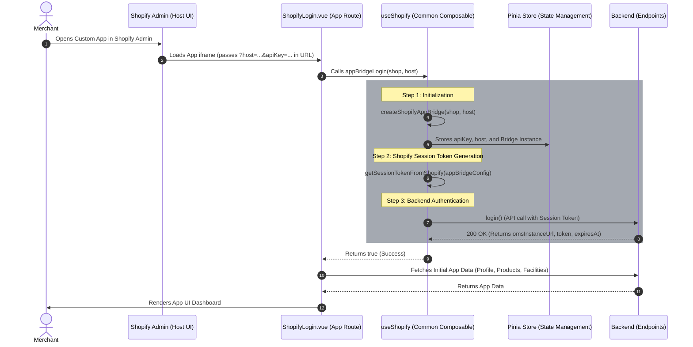

# Shopify Embedded App Integration Architecture

## 1. Overview
### 1.1 Objective
Standardize the embedded app authentication flow and integration layer for Shopify POS within the AccxUI ecosystem.

### 1.2 Problem Statement
Handling authentication flows and contextual states in an embedded Shopify App Bridge iframe differs significantly from standard standalone web apps. It requires a resilient flow to obtain, exchange, and manage session tokens alongside context-specific constraints (e.g., POS location routing).

### 1.3 Success Criteria
- Seamless orchestration of Shopify App Bridge authentication.
- Centralized Pinia state management for embedded credentials and contexts.
- Reliable abstraction of backend API endpoints and session verification.
- Clear conditional separation between web-based implementations and native Shopify POS operations.

## 2. Scope
### 2.1 In Scope
- Shopify App Bridge authentication via the shared `useShopify` composable.
- Universal Pinia state definition for embedded environments (`embeddedAppStore`).
- Route guards and lifecycle component handling tailored for Shopify logic.
- Integration and conditional usage of native POS Scanners and location-based facility filtering.

### 2.2 Out of Scope
- Standard standalone web application login flows using traditional credentials.

## 3. Background / Context
When the app runs as an embedded application within Shopify (particularly Shopify POS), certain native device features and contextual parameters are exposed exclusively via Shopify App Bridge. The application utilizes the `useShopify` composable and the `embeddedApp` store to seamlessly transition and handle execution within standard web-hosted and native embedded contexts.

## 4. Proposed Solution (Current Architecture)

### 4.1 High-Level Design
The embedded app leverages the `useShopify` composable to completely consolidate authentication. The primary entry point is `appBridgeLogin`, which orchestrates creating the bridge, fetching the token, and calling the backend login API to yield authentication credentials (`omsInstanceUrl`, `token`, and `expiresAt`).



### 4.2 Common Functionality Offered
- **The `useShopify` Composable**: Acts as the integration layer between the Shopify context, the Pinia state, and the backend HTTP client.
```typescript
import { Scanner, Features, Group, Redirect } from '@shopify/app-bridge/actions';
import { embeddedApp } from "../store/embeddedAppAuth";
import { createApp } from "@shopify/app-bridge";
import { getSessionToken } from "@shopify/app-bridge-utils";
import api from '../core/remoteApi';

export function useShopify() {
  const store = embeddedApp();

  const createShopifyAppBridge = async (shop: string, host: string) => {
  try {
    if (!shop || !host) {
      throw new Error("Shop or host missing");
    }
    const apiKey = JSON.parse(import.meta.env.VITE_SHOPIFY_SHOP_CONFIG || '{}')[shop]?.apiKey;
    if (!apiKey) {
      throw new Error("Api Key not found");
    }
    const shopifyAppBridgeConfig = {
      apiKey: apiKey || '', 
      host: host || '',
      forceRedirect: false,
    };
    
    const appBridge = createApp(shopifyAppBridgeConfig);

    return Promise.resolve(appBridge);      
  } catch (error) {
    console.error(error);
    return Promise.reject(error);
  }
}

const getSessionTokenFromShopify = async (appBridgeConfig: any) => {
  try {
    if (appBridgeConfig) {
      const shopifySessionToken = await getSessionToken(appBridgeConfig);
      return Promise.resolve(shopifySessionToken);
    } else {
      throw new Error("Invalid App Config");
    }
  } catch (error) {
    return Promise.reject(error);
  }
}

const openPosScanner = (): Promise<any> => {
  return new Promise((resolve, reject) => {
    try {
      const app = store.shopifyAppBridge;

      if (!app) {
        return reject(new Error("Shopify App Bridge not initialized."));
      }

      const scanner = Scanner.create(app);
      const features = Features.create(app);

      const unsubscribeScanner = scanner.subscribe(Scanner.Action.CAPTURE, (payload) => {
        unsubscribeScanner();
        unsubscribeFeatures();
        resolve(payload?.data?.scanData);
      });

      const unsubscribeFeatures = features.subscribe(Features.Action.REQUEST_UPDATE, (payload) => {
        if (payload.feature[Scanner.Action.OPEN_CAMERA]) {
          const available = payload.feature[Scanner.Action.OPEN_CAMERA].Dispatch;
          if (available) {
            scanner.dispatch(Scanner.Action.OPEN_CAMERA);
          } else {
            unsubscribeScanner();
            unsubscribeFeatures();
            reject(new Error("Scanner feature not available."));
          }
        }
      });

      features.dispatch(Features.Action.REQUEST, {
        feature: Group.Scanner,
        action: Scanner.Action.OPEN_CAMERA
      });
    } catch(error) {
      reject(error);
    }
  });
}

  const appBridgeLogin = async (shop: string, host: string) => {
    try {
      if (!shop) shop = embeddedApp().shop
      if (!host) host = embeddedApp().host

      if (!shop || !host) {
        throw new Error("Shop or host missing");
      }
      const shopConfigsStr = import.meta.env.VITE_SHOPIFY_SHOP_CONFIG as string;
      const shopConfigs = shopConfigsStr ? JSON.parse(shopConfigsStr) : {};

      if (!shopConfigs[shop]) {
        throw new Error("Shop config not found");
      }

      const shopConfig = shopConfigs[shop as string];
      const maargUrl = shopConfig.maarg || '';

      // 1. Create Bridge
      const app = await createShopifyAppBridge(shop, host);
      
      // 2. Get Session Token
      const token = await getSessionTokenFromShopify(app);

      const appState: any = await app.getState();

      if (!appState) {
        throw new Error("Couldn't get Shopify App Bridge state, cannot proceed further.");
      }
      // Since the Shopify Admin doesn't provide location and user details,
      // we are using the app state to get the POS location and user details in case of POS Embedded Apps.
      let loginPayload: any = {};
      loginPayload.sessionToken = token;
      if (appState.pos?.location?.id) {
        loginPayload.locationId = appState.pos.location.id
      }
      if (appState.pos?.user?.firstName) {
        loginPayload.firstName = appState.pos.user.firstName;
      }
      if (appState.pos?.user?.lastName) {
        loginPayload.lastName = appState.pos.user.lastName;
      }

      store.$reset();
      
      // 3. Login API Call
      const loginResp = await api({
        url: `${maargUrl}/rest/s1/app-bridge/login`,
        method: 'post',
        data: loginPayload
      });

      if (!loginResp.data.token || !loginResp.data.omsInstanceUrl) {
        throw new Error("Couldn't get token or user from Shopify App Bridge login.");
      }

      store.$patch((state) => {
        state.token.value = loginResp.data.token;
        state.token.expiration = loginResp.data.expiresAt;
        state.oms = loginResp.data.omsInstanceUrl;
        state.maarg = maargUrl;
        state.apiKey = shopConfig.apiKey;
        state.shop = shop;
        state.host = host;
        state.shopifyAppBridge = app;
        state.posContext = {
          locationId: appState.pos?.location?.id,
          firstName: appState.pos?.user?.firstName,
          lastName: appState.pos?.user?.lastName
        };
      });

      return true;
    } catch (error) {
      console.error('Failed the Shopify App Bridge authentication flow:', error);
      return false;
    }
  };

  const redirect = (url: string) => {
    if (store.shopifyAppBridge) {
      Redirect.create(store.shopifyAppBridge).dispatch(Redirect.Action.REMOTE, url);
    }
  }

  const authorise = async (shop: string, host: string) => {
    const shopConfigsStr = import.meta.env.VITE_SHOPIFY_SHOP_CONFIG as string;
    const shopConfigs = shopConfigsStr ? JSON.parse(shopConfigsStr) : {};
    const scopes = import.meta.env.VITE_SHOPIFY_SCOPES || '';
    const shopConfig = shopConfigs[shop];
    const apiKey = shopConfig ? shopConfig.apiKey : '';
    const redirectUri = import.meta.env.VITE_SHOPIFY_REDIRECT_URI || '';
    const permissionUrl = `https://${shop}/admin/oauth/authorize?client_id=${apiKey}&scope=${scopes}&redirect_uri=${redirectUri}`;

    if (window.top == window.self) {
      window.location.assign(permissionUrl);
    } else {
      await createShopifyAppBridge(shop, host);
      redirect(permissionUrl);
    }
  };

  return {
    appBridgeLogin,
    authorise,
    createShopifyAppBridge,
    getSessionTokenFromShopify,
    openPosScanner,
    redirect
  };
}
```

- **Session Verification & Base URL Resolution**: Seamless gap bridging by utilizing `commonUtil.getToken()`, `getOmsURL()`, and `getMaargURL()`. These utilities sequentially verify universal/Pinia state values before falling back to cookies entirely dynamically.

```typescript
// useAuth.ts example session verification relying implicitly on shared utilities.
const isAuthenticated = computed(() => {
  let isTokenExpired = false;
  // commonUtil.getToken() intelligently checks the shared state/environment before falling back to cookies
  const token = commonUtil.getToken();
  const expirationTime = Number(commonUtil.getTokenExpiration());
  if (expirationTime) {
    const currTime = DateTime.now().toMillis();
    isTokenExpired = expirationTime < currTime;
  }
  return !!(token && !isTokenExpired);
});
```

### 4.3 App Building Pattern (How to build using common functionality)
When integrating an app into the Shopify Embedded environment, follow these structural patterns:

1.  **Component Mounting (`ShopifyLogin.vue`)**: You must ensure that whatever component invokes `appBridgeLogin` does it safely when the app loads.
```typescript
import { onMounted } from 'vue';
import router from '@/router';
import { useShopify } from '@accxui/common/composables/useShopify';

export default {
  setup() {
    const route = router.currentRoute.value;
    const { appBridgeLogin } = useShopify();
    
    // Read from route query
    const host = route.query.host as string;
    const apiKey = route.query.apiKey as string;

    onMounted(async () => {
      // Run the composable orchestration function
      const success = await appBridgeLogin(apiKey, host);
      
      if (success) {
        // App is authenticated, fetch app-specific data
        fetchUserProfile();
        fetchProducts();
      }
    });

    return {};
  }
}
```

2.  **API Communication & Request Interceptors**: 
    All ensuing setup API calls (like `fetchUserProfile` or `fetchProducts`) must pass exchanged OMS JWT token against the Shopify Session Token. Your backend HTTP Client should intercept outgoing calls, retrieve the backend authentication `OMS JWT token` from the Pinia store, and append it natively to the `Authorization: Bearer` header.

3.  **Router Guards**:
    In standalone applications, an unauthenticated user is universally redirected to `/login`. In an embedded context, they MUST be redirected backwards into the OAuth flow natively.
```typescript
const authGuard = async (to: any, from: any, next: any) => {
  const { isAuthenticated } = useAuth();
  if (!isAuthenticated.value) {
    if (commonUtil.isAppEmbedded()) {
      next('/shopify-login'); // Trigger Embedded Auth Flow
    } else {
      next('/login'); // Trigger Standard Web Auth Flow
    }
  } else {
    next();
  }
};
```

4.  **Native POS Scanner Integrity**:
    Instead of defaulting to the web-based camera scanner, conditionally check if the app runs strictly inside a Shopify POS context.
```typescript
import { commonUtil, useShopify, useEmbeddedAppStore } from "@common";

const scanCode = async () => {
  // Check if running in a POS context
  if (useEmbeddedAppStore().posContext.locationId) {
    try {
      // Trigger native Shopify POS scanner
      const scannedCode = await useShopify().openPosScanner();
      if (scannedCode) {
        processScannedCode(scannedCode);
      }
    } catch (err) {
      console.error("POS Scanner error:", err);
    }
  } else {
    // Fallback to standard web camera scanner
    if (!(await commonUtil.hasWebcamAccess())) {
      commonUtil.showToast("Camera access not allowed.");
      return;
    }
    // Launch web scanner component...
  }
};
```

5.  **Conditional Element Rendering**: Conditionally load web-based items explicitly if not acting inside Embedded boundaries.
```html
<!-- Only show scan button if NOT embedded, OR if it IS embedded but specifically in a POS context -->
<ion-button 
  v-if="!commonUtil.isAppEmbedded() || useEmbeddedAppStore().posContext.locationId" 
  @click="scanCode()"
>
  <ion-icon slot="start" :icon="barcodeOutline" />
  Scan
</ion-button>
```


## 5. Data State & Storage Strategy

### 5.1 Pinia State Structure
To manage common layout variables (Shopify tokens, API domains, Bridge instances), a dedicated `embeddedAppStore` is formally provisioned globally.

```typescript
import { defineStore } from 'pinia';

export const useEmbeddedAppStore = defineStore('embeddedApp', {
  state: () => ({
    token: {
      value: '',
      expiration: undefined as string | number | undefined
    },
    oms: '',
    maarg: '',
    shop: '',
    apiKey: '',
    host: '',
    shopifyAppBridge: null as any,
    posContext: {} as any
  })
});
```

### 5.2 Data Flow
The structural dataflow maps exclusively:
1.  **Shopify Context** extracts Session Token locally.
2.  **`useShopify` -> Backend API**: Interchanges Session for native OMS JWT Tokens.
3.  **Backend -> `embeddedAppStore`**: Native properties injected back into Pinia stores persistently.
4.  **Pinia -> Interceptors (`commonUtil`)**: The local runtime utilizes reactive state implicitly.

## 6. Security & Permissions
- Shopify Admin environments bypass standard localized cookies; hence Universal state handles authentication tokens cleanly avoiding restriction boundaries.
- **Physical Segregation (Location Filtering)**: When running inside the Shopify POS context, state managers (`productStore.ts`) handle operations strictly mapped securely via `useEmbeddedAppStore().posContext.locationId`.
```typescript
// Only Location's facility for Shopify POS Users.
if (commonUtil.isAppEmbedded() && useEmbeddedAppStore().posContext.locationId) {
  resp = await api({
    url: "oms/shopifyShops/locations",
    method: "GET",
    params: {
      locationId: useEmbeddedAppStore().posContext.locationId
    }
  });

  const locations = resp.data;
  facilityIds = locations.map((location: any) => location.facilityId);
  // ...
}
```
This guarantees an isolated operational context blocking embedded POS users from accidentally interacting with invalid physical terminal parameters securely.

## 7. Verification Plan
- **Route Guard Edge Cases**: Systematically test route traversal switching from `standalone` local host directly to `?embedded=1` contexts verifying tokens refresh unconditionally without `Login.vue` exposure.
- **Location Mapping Integrity**: Ensure mock `locationId` contexts strictly restrict un-assigned `facilityIds`.

## 8. References
- [Shopify App Bridge Documentation](https://shopify.dev/docs/api/app-bridge)
- [Ionic Documentation](https://ionicframework.com/docs)
- [Vue 3 Documentation](https://vuejs.org/guide/introduction.html)
