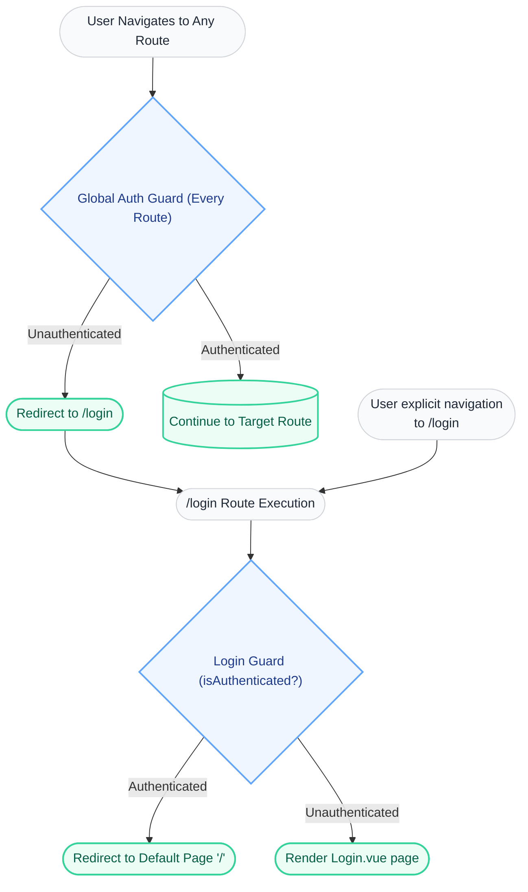
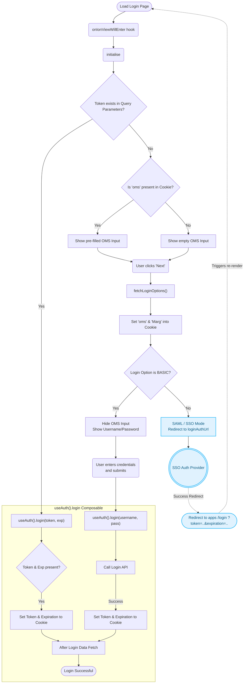

# Authentication & Login Flow Design Document

---

## 1. Overview
### 1.1 Objective
Document the standardized routing and authentication flow across the AccxUI, defining the global navigation guards, the route-specific login guard, the `Login.vue` initialisation, and the final token application via the `useAuth().login` composable.

### 1.2 Problem Statement
To provide a consolidated view of how a user proceeds from an initial navigation event to an authenticated state, mapping out both direct login with basic credentials and SAML-based Single Sign-On (SSO). It addresses specific scenarios depending on whether the OMS identifier is known or unknown.

### 1.3 Success Criteria
A clear, maintainable artifact that development teams can reference when modifying routing, bootstrapping session states, or augmenting the multi-tenant IDP (Identity Provider) mechanisms.

## 2. Scope
### 2.1 In Scope
- Vue Router global navigation guards (`authGuard`).
- Application-specific `/login` route guard (`loginGuard`).
- `Login.vue` lifecycle hooks (`onIonViewWillEnter`, `initialise`).
- Multi-tenant IDP rule checks (`fetchLoginOptions`).
- Processing logic within the central `useAuth().login` capability.

### 2.2 Out of Scope
- Backend/Server implementation of SAML exchanges.
- Details of the post-login store hydration beyond the initial API fetch trigger.
- User registration and password reset workflows.

## 3. Background / Context
The AccxUI applications serve multiple deployment topologies and organizations (OMS profiles), necessitating a dynamic login form that queries identity provider specifics dynamically before presenting credential inputs. Furthermore, strict routing guarantees ensure that access boundaries are respected universally, blocking unauthorized route navigation prior to rendering any protected UI framework components.

## 4. Proposed Solution
### 4.1 High-Level Design
The security architecture encompasses three logical boundaries:
1. **Global Auth Guard**: Intercepts every route dispatch. If unauthenticated, automatically bounces the request to `/login`.
2. **Login Guard**: Polices the `/login` route specifically. Re-routes fully authenticated sessions to the default authenticated application context (typically `"/"`).
3. **Login View & Composable**: Identifies the tenant from cookies or input, fetches the application mode (BASIC vs SAML), executes credential submission, manages SSO URL parameters, captures JWT tokens, and hands everything off to the unified `useAuth` composable state function.

### 4.2 UI Mockup
*N/A - Design logic focuses heavily on routing and application state transition rather than static visual renderings.*

### 4.3 Diagrams

#### 4.3.1 Routing & Navigation Guard Topology
This diagram demonstrates the hierarchy between the `authGuard` placed on every route versus the `loginGuard` isolated to the target `/login` resolution phase.



#### 4.3.2 Login.vue Conditional Execution & State Matrix
Visualizes what transpires specifically within the `Login.vue` file. Accounts for the four distinct logic branches based on Cookie status vs Authentication type (BASIC vs SAML).



### 4.4 Data State & Storage Strategy
#### 4.4.1 Pinia State Structure
The user identity values, active facility entitlements, and user-level component configurations are not loaded pre-auth; they are strictly loaded post-login during the `after login data fetch` action inside internal stores like `user` or `store`.

#### 4.4.2 Document/Cookie Storage Strategy
- `oms`: Stored as a browser cookie. It persists across browsing sessions to accelerate the login pipeline by pre-filling the environment identifier.
- `Marg`: Accompanying tracking parameter retrieved seamlessly alongside the network configuration rules.
- Core Identity: Authenticated state entirely depends on validation cookies encapsulating bearer token durations/dates.

#### 4.4.3 Data Flow & Sync
- Navigation (Guest) → Redirect via Route Guards → `Login.vue` loads parameters/cookies.
- UI Captures OMS → Network fetch for tenant profile → Branching strategy dynamically updates component state (`BASIC` vs `SAML`).
- `useAuth()` unifies backend validation checks and applies the resulting token boundaries to the frontend environment.

### 4.5 Pseudocode / Logic Flow
**Global Router Abstraction:**
```javascript
// Within setup or index mapping for the vue router
router.beforeEach((to, from, next) => {
  if (!isAuthenticated && to.path !== '/login') {
    next('/login'); // auth guard triggers
  } else if (isAuthenticated && to.path === '/login') {
    next('/'); // login guard bounces
  } else {
    next(); 
  }
});
```

**Login Component Initialization Sequence:**
```javascript
// executed via onIonViewWillEnter on Login.vue
async function initialise() {
  if (route.query.token && route.query.expirationDate) {
    // Escaped out of standard inputs; user arriving with active external assertions.
    await useAuth().login(route.query.token, route.query.expirationDate);
  } else {
    // Interactive Boot Protocol
    oms.value = readCookie('oms');
    showOmsInput.value = true;
  }
}
```

### 4.6 Alternatives Considered
- Writing entirely discrete components for `LoginBasic.vue` and `LoginSSO.vue` instead of keeping a single dynamic component footprint. 
- *Why rejected*: Because the execution `fetchLoginOptions()` must determine IDP dynamically based on user entry. A consolidated reactive page decreases the navigation complexity matrix and keeps the user context visually unbroken.

## 5. Security & Permissions
- Strict Router guarding enforces that underlying resources, HTTP components, and route boundaries remain isolated from potentially unauthenticated clients.
- Ensuring tokens are mapped aggressively matching domain signatures allows subsequent REST requests wrapping `useAuth()` properties to natively express Identity traits properly on Accx backend gateways. 

## 6. Verification Plan
- **Test:** Verify standard navigation to a guarded route clears history properly and defaults mapping to `/login`.
- **Test:** Verify navigating specifically to `/login` seamlessly redirects users carrying an active login claim token backwards to `"/"`.
- **Test (Basic):** Input valid OMS suffix -> Assert Basic credential inputs manifest -> Submitting yields dashboard rendering.
- **Test (SAML/SSO):** Input valid OMS linked to SAML rules -> Assert direct provider offload logic triggers effectively.

## 7. Rollout Plan
Enhancements dictating router topology adjustments (i.e. Global `authGuard` shifts) must be systematically assessed over existing deeper applications logic paths (e.g., reset links) within the AccxUI repos to prevent any dead-end regressions.

## 8. Risks & Mitigation
**Risk:** Re-entry transitions from SSO services (e.g. Okta/Ping) failing to effectively trigger `/login` due to base path inconsistencies in nested apps targeting multi-domain deployments.
**Mitigation:** Verify mapped `ReturnURLs` adhere precisely to `window.location.origin` rulesets, explicitly anchoring to application scopes (e.g. `tenant.accx.com/bopis/login?token=xyz...`).

## 9. References
- Internal Architecture Documents
- Vue Router v4 Navigation Guards Context Specs
- Accxui Frontend Routing Configurations
