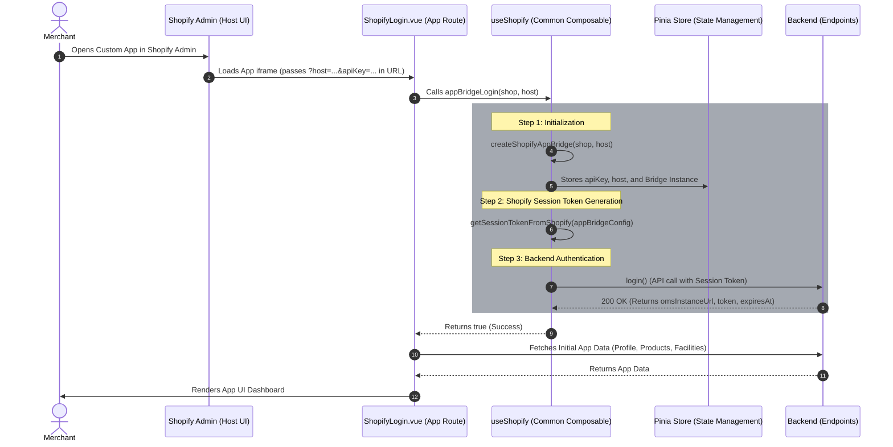

# Shopify Embedded App Integration Design

## 1. Flow Diagram

Here is the sequence diagram illustrating the embedded app authentication flow using the `useShopify` Composable. 

The primary entry point is `appBridgeLogin`, which sequentially orchestrates creating the bridge, fetching the token, and calling the backend login API to yield the authentication credentials (`omsInstanceUrl`, `token`, and `expiresAt`).



## 2. Design Analysis & Suggestions

By centralizing everything into the `useShopify` composable, we consolidate the authentication orchestration into a single, cohesive module.

### A. Pinia State Definition (`embeddedAppStore`)

To manage common variables (like Shopify tokens, OMS identifier, and layout configs), define a dedicated Pinia store.

*Conceptual Structure of `stores/embeddedAppStore.ts`:*
```typescript
import { defineStore } from 'pinia';

export const useEmbeddedAppStore = defineStore('embeddedApp', {
  state: () => ({
    token: {
      value: '',
      expiration: undefined as string | number | undefined
    },
    oms: '',
    maarg: '',
    shop: '',
    apiKey: '',
    host: '',
    shopifyAppBridge: null as any
  })
});
```

### B. The `useShopify` Composable Structure

The composable handles exactly what the diagram depicts, acting as the integration layer between the Shopify context, your Pinia state, and the backend HTTP client.

*Conceptual Structure of `useShopify.ts`:*
```typescript
import { Scanner, Features, Group, Redirect } from '@shopify/app-bridge/actions';
import { embeddedApp } from "../store/embeddedAppAuth";
import { createApp } from "@shopify/app-bridge";
import { getSessionToken } from "@shopify/app-bridge-utils";
import api from '../core/remoteApi';

export function useShopify() {
  const store = embeddedApp();

  const createShopifyAppBridge = async (shop: string, host: string) => {
  try {
    if (!shop || !host) {
      throw new Error("Shop or host missing");
    }
    const apiKey = JSON.parse(import.meta.env.VITE_SHOPIFY_SHOP_CONFIG || '{}')[shop]?.apiKey;
    if (!apiKey) {
      throw new Error("Api Key not found");
    }
    const shopifyAppBridgeConfig = {
      apiKey: apiKey || '', 
      host: host || '',
      forceRedirect: false,
    };
    
    const appBridge = createApp(shopifyAppBridgeConfig);

    return Promise.resolve(appBridge);      
  } catch (error) {
    console.error(error);
    return Promise.reject(error);
  }
}

const getSessionTokenFromShopify = async (appBridgeConfig: any) => {
  try {
    if (appBridgeConfig) {
      const shopifySessionToken = await getSessionToken(appBridgeConfig);
      return Promise.resolve(shopifySessionToken);
    } else {
      throw new Error("Invalid App Config");
    }
  } catch (error) {
    return Promise.reject(error);
  }
}

const openPosScanner = (): Promise<any> => {
  return new Promise((resolve, reject) => {
    try {
      const app = store.shopifyAppBridge;

      if (!app) {
        return reject(new Error("Shopify App Bridge not initialized."));
      }

      const scanner = Scanner.create(app);
      const features = Features.create(app);

      const unsubscribeScanner = scanner.subscribe(Scanner.Action.CAPTURE, (payload) => {
        unsubscribeScanner();
        unsubscribeFeatures();
        resolve(payload?.data?.scanData);
      });

      const unsubscribeFeatures = features.subscribe(Features.Action.REQUEST_UPDATE, (payload) => {
        if (payload.feature[Scanner.Action.OPEN_CAMERA]) {
          const available = payload.feature[Scanner.Action.OPEN_CAMERA].Dispatch;
          if (available) {
            scanner.dispatch(Scanner.Action.OPEN_CAMERA);
          } else {
            unsubscribeScanner();
            unsubscribeFeatures();
            reject(new Error("Scanner feature not available."));
          }
        }
      });

      features.dispatch(Features.Action.REQUEST, {
        feature: Group.Scanner,
        action: Scanner.Action.OPEN_CAMERA
      });
    } catch(error) {
      reject(error);
    }
  });
}

  const appBridgeLogin = async (shop: string, host: string) => {
    try {
      if (!shop) shop = embeddedApp().shop
      if (!host) host = embeddedApp().host

      if (!shop || !host) {
        throw new Error("Shop or host missing");
      }
      const shopConfigsStr = import.meta.env.VITE_SHOPIFY_SHOP_CONFIG as string;
      const shopConfigs = shopConfigsStr ? JSON.parse(shopConfigsStr) : {};

      if (!shopConfigs[shop]) {
        throw new Error("Shop config not found");
      }

      const shopConfig = shopConfigs[shop as string];
      const maargUrl = shopConfig.maarg || '';

      // 1. Create Bridge
      const app = await createShopifyAppBridge(shop, host);
      
      // 2. Get Session Token
      const token = await getSessionTokenFromShopify(app);

      const appState: any = await app.getState();

      if (!appState) {
        throw new Error("Couldn't get Shopify App Bridge state, cannot proceed further.");
      }
      // Since the Shopify Admin doesn't provide location and user details,
      // we are using the app state to get the POS location and user details in case of POS Embedded Apps.
      let loginPayload: any = {};
      loginPayload.sessionToken = token;
      if (appState.pos?.location?.id) {
        loginPayload.locationId = appState.pos.location.id
      }
      if (appState.pos?.user?.firstName) {
        loginPayload.firstName = appState.pos.user.firstName;
      }
      if (appState.pos?.user?.lastName) {
        loginPayload.lastName = appState.pos.user.lastName;
      }

      store.$reset();
      
      // 3. Login API Call
      const loginResp = await api({
        url: `${maargUrl}/rest/s1/app-bridge/login`,
        method: 'post',
        data: loginPayload
      });

      if (!loginResp.data.token || !loginResp.data.omsInstanceUrl) {
        throw new Error("Couldn't get token or user from Shopify App Bridge login.");
      }

      store.$patch((state) => {
        state.token.value = loginResp.data.token;
        state.token.expiration = loginResp.data.expiresAt;
        state.oms = loginResp.data.omsInstanceUrl;
        state.maarg = maargUrl;
        state.apiKey = shopConfig.apiKey;
        state.shop = shop;
        state.host = host;
        state.shopifyAppBridge = app;
        state.posContext = {
          locationId: appState.pos?.location?.id,
          firstName: appState.pos?.user?.firstName,
          lastName: appState.pos?.user?.lastName
        };
      });

      return true;
    } catch (error) {
      console.error('Failed the Shopify App Bridge authentication flow:', error);
      return false;
    }
  };

  const redirect = (url: string) => {
    if (store.shopifyAppBridge) {
      Redirect.create(store.shopifyAppBridge).dispatch(Redirect.Action.REMOTE, url);
    }
  }

  const authorise = async (shop: string, host: string) => {
    const shopConfigsStr = import.meta.env.VITE_SHOPIFY_SHOP_CONFIG as string;
    const shopConfigs = shopConfigsStr ? JSON.parse(shopConfigsStr) : {};
    const scopes = import.meta.env.VITE_SHOPIFY_SCOPES || '';
    const shopConfig = shopConfigs[shop];
    const apiKey = shopConfig ? shopConfig.apiKey : '';
    const redirectUri = import.meta.env.VITE_SHOPIFY_REDIRECT_URI || '';
    const permissionUrl = `https://${shop}/admin/oauth/authorize?client_id=${apiKey}&scope=${scopes}&redirect_uri=${redirectUri}`;

    if (window.top == window.self) {
      window.location.assign(permissionUrl);
    } else {
      await createShopifyAppBridge(shop, host);
      redirect(permissionUrl);
    }
  };

  return {
    appBridgeLogin,
    authorise,
    createShopifyAppBridge,
    getSessionTokenFromShopify,
    openPosScanner,
    redirect
  };
}
```

### C. Route Guard vs Component Handling

You must ensure that whatever component or router guard invokes `appBridgeLogin` does it safely when the app loads. In `ShopifyLogin.vue`:

```typescript
import { onMounted } from 'vue';
import router from '@/router';
import { useShopify } from '@accxui/common/composables/useShopify';

export default {
  setup() {
    const route = router.currentRoute.value;
    const { appBridgeLogin } = useShopify();
    
    // Read from route query
    const host = route.query.host as string;
    const apiKey = route.query.apiKey as string;

    onMounted(async () => {
      // Run the composable orchestration function
      const success = await appBridgeLogin(apiKey, host);
      
      if (success) {
        // App is authenticated, fetch app-specific data
        fetchUserProfile();
        fetchProducts();
      }
    });

    return {};
  }
}
```

### D. Backend API Request Interceptor remains vital

Even though logging in is handled sequentially, remember that **all** ensuing app setup API calls (like `fetchUserProfile` or `fetchProducts`) must pass exchanged OMS JWT token against the Shopify Session Token.
Your backend HTTP Client (e.g., Axios) should intercept outgoing calls, retrieve the exchanged backend authentication `OMS JWT token` from the Pinia store (the result of the payload in `appBridgeLogin`), and append it to the `Authorization: Bearer` header.

### E. Session Checking (`useAuth.ts` and `isAuthenticated`)

To seamlessly bridge the gap between cookies (used in standalone environments) and Pinia store token-injection (used via the App Bridge context in embedded apps), the `isAuthenticated` computed property within `useAuth.ts` (across embedded-capable applications) leverages `commonUtil` shared methods.

Instead of directly probing cookies using `cookieHelper()`, the `isAuthenticated` getter dynamically verifies session validity from Universal/Pinia state seamlessly:

```typescript
const isAuthenticated = computed(() => {
  let isTokenExpired = false;
  // commonUtil.getToken() intelligently checks the shared state/environment before falling back to cookies
  const token = commonUtil.getToken();
  const expirationTime = Number(commonUtil.getTokenExpiration());
  if (expirationTime) {
    const currTime = DateTime.now().toMillis();
    isTokenExpired = expirationTime < currTime;
  }
  return !!(token && !isTokenExpired);
});
```
This architectural decision ensures that the standard Vue application routing and authentication guards (`authGuard`) automatically validate users authenticated exclusively via Shopify App Bridge POS, eradicating the need for separate embedded vs. standalone authentication guard logic paths.

### F. Base URL Resolution (`getOmsURL` and `getMaargURL`)

Similar to the authentication session checks, the core utility methods for resolving the backend APIs prioritize the Pinia state before falling back to cookies.

*   **`getOmsURL()`**: Checks `useEmbeddedAppStore().oms` before querying `cookieHelper().get("oms")`.
*   **`getMaargURL()`**: Checks `useEmbeddedAppStore().maarg` before querying `cookieHelper().get("maarg")`.

This directly enables reliable environment routing logic regardless of third-party cookie constraints placed on embedded embedded iframes.

### G. Route Guards (`authGuard`)

In standalone applications, an unauthenticated user is universally redirected to the `/login` route. However, in an embedded context, we must redirect them to the `/shopify-login` initializing component instead so the App Bridge OAuth flow can seamlessly execute natively.

The updated `authGuard` handles this conditional routing using `commonUtil.isAppEmbedded()`:

```typescript
const authGuard = async (to: any, from: any, next: any) => {
  const { isAuthenticated } = useAuth();
  if (!isAuthenticated.value) {
    if (commonUtil.isAppEmbedded()) {
      next('/shopify-login'); // Trigger Embedded Auth Flow
    } else {
      next('/login'); // Trigger Standard Web Auth Flow
    }
  } else {
    next();
  }
};
```
By implementing this check, embedded instances immediately intercept token depletion and loop directly back into auto-renewing their App Bridge session without surfacing the web login credentials portal.


## 3. Specific Component Integrations

When the app runs as an embedded application within Shopify POS, certain native device features (like the camera scanner) are exposed via Shopify App Bridge. The application utilizes `useShopify` and the `embeddedApp` store to seamlessly transition between web-based implementations and native POS implementations.

### A. POS Scanner Integration

Several components across the fulfillment application leverage the embedded POS Scanner to streamline operations directly from Shopify POS hardware.

**Implementation Pattern:**
Instead of defaulting to the web-based camera scanner, components first check if the app is currently running within a Shopify POS context by verifying `embeddedApp().posContext.locationId`. If true, they invoke the native scanner via `useShopify().openPosScanner()`.

*Example Usage in Components:*
```typescript
import { commonUtil, useShopify, useEmbeddedAppStore } from "@common";

const scanCode = async () => {
  // Check if running in a POS context
  if (useEmbeddedAppStore().posContext.locationId) {
    try {
      // Trigger native Shopify POS scanner
      const scannedCode = await useShopify().openPosScanner();
      if (scannedCode) {
        processScannedCode(scannedCode);
      }
    } catch (err) {
      console.error("POS Scanner error:", err);
    }
  } else {
    // Fallback to standard web camera scanner
    if (!(await commonUtil.hasWebcamAccess())) {
      commonUtil.showToast("Camera access not allowed.");
      return;
    }
    // Launch web scanner component...
  }
};
```

### B. Conditional UI Rendering (`isAppEmbedded`)

Components also use `commonUtil.isAppEmbedded()` (which checks `!!useEmbeddedAppStore().shopifyAppBridge`) combined with `useEmbeddedAppStore().posContext.locationId` to conditionally display UI elements that are only applicable outside of the embedded context or specifically within certain POS contexts.

*Example Usage in Templates:*
```html
<!-- Only show scan button if NOT embedded, OR if it IS embedded but specifically in a POS context -->
<ion-button 
  v-if="!commonUtil.isAppEmbedded() || useEmbeddedAppStore().posContext.locationId" 
  @click="scanCode()"
>
  <ion-icon slot="start" :icon="barcodeOutline" />
  Scan
</ion-button>
```

### C. Facility and Location Filtering (`productStore.ts`)

When running inside the Shopify POS context, an embedded user operates within a specific physical store. The `productStore.ts` (across both apps) handles this by limiting the facilities available to the user based securely on the Shopify POS `locationId`.

During `fetchUserFacilities()`, the state management strictly requests matching OMS facilities assigned to that individual Shopify Location:
```typescript
// Only Location's facility for Shopify POS Users.
if (commonUtil.isAppEmbedded() && useEmbeddedAppStore().posContext.locationId) {
  resp = await api({
    url: "oms/shopifyShops/locations",
    method: "GET",
    params: {
      locationId: useEmbeddedAppStore().posContext.locationId
    }
  });

  const locations = resp.data;
  facilityIds = locations.map((location: any) => location.facilityId);
  // ...
}
```
This guarantees an isolated operational context per terminal, blocking embedded POS users from accidentally accepting or fulfilling orders for an external physical store.
